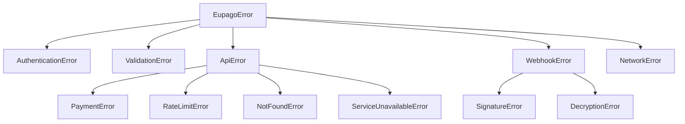

# Errors & Troubleshooting

## Exception hierarchy

All SDK exceptions inherit from `EupagoError`. You can catch `EupagoError` to handle any SDK error, or be more specific.



---

## Exception reference

### EupagoError

**Base class** for all SDK exceptions.

| Attribute | Type | Description |
|---|---|---|
| `message` | `str` | Error message |

```python
from eupago.exceptions import EupagoError

try:
    result = client.mbway.create_payment(...)
except EupagoError as e:
    print(f"eupago error: {e.message}")
```

---

### AuthenticationError

**Invalid API key** or expired OAuth token.

When raised:

- Incorrect or deactivated API key
- Expired OAuth token that cannot be renewed
- Sandbox credentials used in production (or vice versa)

```python
from eupago.exceptions import AuthenticationError

try:
    result = client.mbway.create_payment(...)
except AuthenticationError:
    # Check the API key in the eupago backoffice
    ...
```

---

### ValidationError

**Invalid parameters** detected locally, before calling the API.

When raised:

- Negative or zero amount
- Amount exceeds the maximum allowed
- Phone number with invalid format
- Missing required fields

```python
from eupago.exceptions import ValidationError

try:
    result = client.mbway.create_payment(
        order_id="ORD-001",
        amount=Decimal("-5.00"),  # Invalid!
        phone_number="912345678",
    )
except ValidationError as e:
    print(f"Invalid parameters: {e.message}")
```

---

### ApiError

**Error returned by the eupago API.** Base class for specific API errors.

| Attribute | Type | Description |
|---|---|---|
| `message` | `str` | Error message |
| `status_code` | `int \| None` | HTTP status code |
| `error_code` | `int \| None` | eupago error code |
| `request_id` | `str \| None` | Request ID for debugging |

```python
from eupago.exceptions import ApiError

try:
    result = client.mbway.create_payment(...)
except ApiError as e:
    print(f"API error: {e.message}")
    print(f"HTTP: {e.status_code}")
    print(f"eupago code: {e.error_code}")
```

---

### PaymentError

**Payment failed** or declined by eupago.

When raised:

- Payment declined by the bank
- Payment service inactive
- Invalid reference

---

### RateLimitError

**Request rate limited** by eupago (HTTP 429).

How to handle:

```python
from eupago.exceptions import RateLimitError

try:
    result = client.mbway.create_payment(...)
except RateLimitError:
    # Wait and try again (only for queries, never for POST)
    ...
```

---

### NotFoundError

**Reference or transaction not found.**

When raised:

- Non-existent transaction ID
- Invalid payment reference

---

### ServiceUnavailableError

**eupago API unavailable** (HTTP 503).

How to handle:

- Check [eupago status](https://www.eupago.com)
- Try again later
- The SDK retries automatically on GETs

---

### WebhookError

**Webhook processing error.** Base class for webhook errors.

---

### SignatureError

**Invalid HMAC signature** on webhook.

When raised:

- The `X-Signature` header does not match the body
- Wrong webhook secret
- Body was modified in transit

```python
from eupago.exceptions import SignatureError

try:
    event = parse_webhook(body=body, headers=headers, webhook_secret=secret)
except SignatureError:
    # Reject — possible forgery attempt
    return Response(status_code=403)
```

---

### DecryptionError

**Failed to decrypt** the webhook payload.

When raised:

- `cryptography` package not installed
- Wrong webhook secret
- Corrupted IV
- Corrupted encrypted data

```python
from eupago.exceptions import DecryptionError

try:
    event = parse_webhook(body=body, headers=headers, webhook_secret=secret)
except DecryptionError as e:
    print(f"Decryption failed: {e.message}")
```

---

### NetworkError

**Network error**: timeout, connection refused, DNS failure.

When raised:

- API connection timeout
- Server unreachable
- DNS error

```python
from eupago.exceptions import NetworkError

try:
    result = client.mbway.create_payment(...)
except NetworkError:
    # Check network connection
    ...
```

---

## eupago error codes (legacy)

The legacy eupago API returns numeric codes in the response field. The SDK converts them to exceptions automatically.

| Code | Meaning | SDK Exception |
|---|---|---|
| `0` | Success | _(no exception)_ |
| `-7` | Service inactive — the payment method is not active on your channel | `PaymentError` |
| `-8` | Invalid reference — incorrect reference format or number | `PaymentError` |
| `-9` | Incorrect values — amount or other fields have wrong values | `ValidationError` |
| `-10` | Invalid key — wrong or deactivated API key | `AuthenticationError` |
| `-11` | Payment not found — non-existent transaction ID | `NotFoundError` |
| `-12` | Invalid alias — MB WAY phone number with wrong format | `ValidationError` |

---

## Troubleshooting

### "Invalid API key"

**Symptom:** `AuthenticationError` on all requests.

**Solutions:**

1. Check the API key in the [eupago backoffice](https://clientes.eupago.pt) > Canais > Listagem de Canais
2. Confirm you are using `sandbox=True` with a sandbox key
3. Verify there are no spaces or extra characters in the key
4. Request a new key from support: suporte@eupago.pt

```python
# Check you are using the correct environment
client = EupagoClient(
    api_key="xxxx-xxxx-xxxx-xxxx-xxxx",
    sandbox=True,  # True for sandbox, False for production
)
```

---

### "Webhook not received"

**Symptom:** The payment was made, but your server did not receive the webhook.

**Solutions:**

1. **Check the URL in the backoffice** — Canais > Listagem de Canais > Callback URL
2. **Verify the URL is publicly accessible** — eupago needs to reach your server
3. **Check the firewall** — ports 80/443 must be open for eupago IPs
4. **Return HTTP 200** — if you return another code, eupago will retry
5. **Check server logs** — look for 500 errors or timeouts
6. **Use ngrok in development** — `ngrok http 8000`

```bash
# Test if the URL is accessible
curl -X POST https://your-server.com/eupago/callback \
  -H "Content-Type: application/json" \
  -d '{"test": true}'
```

---

### "Duplicate payment"

**Symptom:** The same payment appears twice in your system.

**Cause:** Retrying a POST request to the eupago API. eupago does not support idempotency keys.

**Solutions:**

1. **Never retry POST** — the SDK already enforces this
2. **Check your code** — is the "Pay" button protected against double-click?
3. **Use `order_id`** as a unique key — if it already exists, do not create another payment

```python
# CORRECT — check before creating
existing = db.payments.find(order_id="ORD-001")
if existing:
    return existing  # Return the existing payment

result = client.mbway.create_payment(
    order_id="ORD-001",
    amount=Decimal("49.90"),
    phone_number="351#912345678",
)
```

!!! danger "POST never retries"
    The SDK never retries POST requests. If a POST fails with a timeout, **do not** try again — check the status via a query (GET) first.

---

### "Timeout"

**Symptom:** `NetworkError` with a timeout message.

**Solutions:**

1. **Increase the timeout** — the default is 10 seconds

    ```python
    client = EupagoClient(api_key="...", timeout=30.0)
    ```

2. **Check your network** — ping `sandbox.eupago.pt` or `clientes.eupago.pt`
3. **Check if eupago is operational** — temporary issues on their side
4. **Use async** — avoid blocking the main thread in web applications

```bash
# Test connectivity
curl -v https://sandbox.eupago.pt/api/v1.02/mbway/create
```

---

## Recommended error handling pattern

```python
from eupago.exceptions import (
    AuthenticationError,
    EupagoError,
    NetworkError,
    PaymentError,
    RateLimitError,
    ValidationError,
)

try:
    result = client.mbway.create_payment(
        order_id="ORD-001",
        amount=Decimal("49.90"),
        phone_number="351#912345678",
    )
except ValidationError as e:
    # Invalid parameters — fix in your code
    logger.error("Validation failed: %s", e.message)
except AuthenticationError:
    # Wrong API key — check configuration
    logger.critical("Invalid API key!")
except PaymentError as e:
    # Payment declined — inform the user
    logger.warning("Payment declined: %s (code=%s)", e.message, e.error_code)
except RateLimitError:
    # Rate limit — wait and try again (GETs only)
    logger.warning("Rate limit reached")
except NetworkError:
    # Network issue — try later
    logger.error("Network error")
except EupagoError as e:
    # Catch-all for other errors
    logger.error("Unexpected error: %s", e.message)
```
