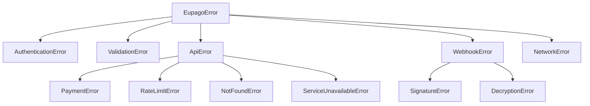

# Erros e Troubleshooting

## Hierarquia de excepcoes

Todas as excepcoes do SDK herdam de `EupagoError`. Podes capturar `EupagoError` para apanhar qualquer erro do SDK, ou ser mais especifico.



---

## Referencia de excepcoes

### EupagoError

**Classe base** para todas as excepcoes do SDK.

| Atributo | Tipo | Descricao |
|---|---|---|
| `message` | `str` | Mensagem de erro |

```python
from eupago.exceptions import EupagoError

try:
    result = client.mbway.create_payment(...)
except EupagoError as e:
    print(f"Erro eupago: {e.message}")
```

---

### AuthenticationError

**API key invalida** ou token OAuth expirado.

Quando e lancada:

- API key incorrecta ou desactivada
- Token OAuth expirado e nao renovavel
- Credenciais de sandbox usadas em producao (ou vice-versa)

```python
from eupago.exceptions import AuthenticationError

try:
    result = client.mbway.create_payment(...)
except AuthenticationError:
    # Verificar a API key no backoffice eupago
    ...
```

---

### ValidationError

**Parametros invalidos** detectados localmente, antes de chamar a API.

Quando e lancada:

- Montante negativo ou zero
- Montante excede o maximo permitido
- Numero de telefone com formato invalido
- Campos obrigatorios em falta

```python
from eupago.exceptions import ValidationError

try:
    result = client.mbway.create_payment(
        order_id="ORD-001",
        amount=Decimal("-5.00"),  # Invalido!
        phone_number="912345678",
    )
except ValidationError as e:
    print(f"Parametros invalidos: {e.message}")
```

---

### ApiError

**Erro retornado pela API eupago.** Classe base para erros de API especificos.

| Atributo | Tipo | Descricao |
|---|---|---|
| `message` | `str` | Mensagem de erro |
| `status_code` | `int \| None` | Codigo HTTP |
| `error_code` | `int \| None` | Codigo de erro eupago |
| `request_id` | `str \| None` | ID do request para debug |

```python
from eupago.exceptions import ApiError

try:
    result = client.mbway.create_payment(...)
except ApiError as e:
    print(f"Erro API: {e.message}")
    print(f"HTTP: {e.status_code}")
    print(f"Codigo eupago: {e.error_code}")
```

---

### PaymentError

**Pagamento falhado** ou recusado pela eupago.

Quando e lancada:

- Pagamento recusado pelo banco
- Servico de pagamento inactivo
- Referencia invalida

---

### RateLimitError

**Pedido limitado** pela eupago (HTTP 429).

Como lidar:

```python
from eupago.exceptions import RateLimitError

try:
    result = client.mbway.create_payment(...)
except RateLimitError:
    # Esperar e tentar novamente (apenas para consultas, nunca para POST)
    ...
```

---

### NotFoundError

**Referencia ou transacao nao encontrada.**

Quando e lancada:

- Transaction ID inexistente
- Referencia de pagamento invalida

---

### ServiceUnavailableError

**API eupago indisponivel** (HTTP 503).

Como lidar:

- Verificar [status da eupago](https://www.eupago.com)
- Tentar novamente mais tarde
- O SDK faz retry automatico em GETs

---

### WebhookError

**Erro no processamento de webhook.** Classe base para erros de webhook.

---

### SignatureError

**Assinatura HMAC invalida** no webhook.

Quando e lancada:

- O header `X-Signature` nao corresponde ao body
- Webhook secret errado
- Body foi modificado em transito

```python
from eupago.exceptions import SignatureError

try:
    event = parse_webhook(body=body, headers=headers, webhook_secret=secret)
except SignatureError:
    # Rejeitar — possivel tentativa de falsificacao
    return Response(status_code=403)
```

---

### DecryptionError

**Falha na desencriptacao** do payload do webhook.

Quando e lancada:

- Pacote `cryptography` nao instalado
- Webhook secret errado
- IV corrompido
- Dados encriptados corrompidos

```python
from eupago.exceptions import DecryptionError

try:
    event = parse_webhook(body=body, headers=headers, webhook_secret=secret)
except DecryptionError as e:
    print(f"Desencriptacao falhou: {e.message}")
```

---

### NetworkError

**Erro de rede**: timeout, conexao recusada, falha DNS.

Quando e lancada:

- Timeout na ligacao a API
- Servidor inacessivel
- Erro de DNS

```python
from eupago.exceptions import NetworkError

try:
    result = client.mbway.create_payment(...)
except NetworkError:
    # Verificar conexao de rede
    ...
```

---

## Codigos de erro eupago (legacy)

A API legacy da eupago retorna codigos numericos no campo de resposta. O SDK converte-os em excepcoes automaticamente.

| Codigo | Significado | Excepcao SDK |
|---|---|---|
| `0` | Sucesso | _(sem excepcao)_ |
| `-7` | Servico inactivo — o metodo de pagamento nao esta activo no teu canal | `PaymentError` |
| `-8` | Referencia invalida — formato ou numero de referencia incorrecto | `PaymentError` |
| `-9` | Valores incorrectos — montante ou outros campos com valores errados | `ValidationError` |
| `-10` | Chave invalida — API key errada ou desactivada | `AuthenticationError` |
| `-11` | Pagamento nao encontrado — transaction ID inexistente | `NotFoundError` |
| `-12` | Alias invalido — numero de telefone MB WAY com formato errado | `ValidationError` |

---

## Troubleshooting

### "API key invalida"

**Sintoma:** `AuthenticationError` em todos os pedidos.

**Solucoes:**

1. Verifica a API key no [backoffice eupago](https://clientes.eupago.pt) > Canais > Listagem de Canais
2. Confirma que estas a usar `sandbox=True` com uma key de sandbox
3. Verifica que nao ha espacos ou caracteres extra na key
4. Pede uma nova key ao suporte: suporte@eupago.pt

```python
# Verifica se estás a usar o ambiente correcto
client = EupagoClient(
    api_key="xxxx-xxxx-xxxx-xxxx-xxxx",
    sandbox=True,  # True para sandbox, False para producao
)
```

---

### "Webhook nao chegou"

**Sintoma:** O pagamento foi feito, mas o teu servidor nao recebeu o webhook.

**Solucoes:**

1. **Verifica o URL no backoffice** — Canais > Listagem de Canais > Callback URL
2. **Verifica se o URL e acessivel publicamente** — a eupago precisa de aceder ao teu servidor
3. **Verifica a firewall** — portas 80/443 devem estar abertas para os IPs da eupago
4. **Retorna HTTP 200** — se retornas outro codigo, a eupago tenta reenviar
5. **Verifica os logs do servidor** — procura erros 500 ou timeouts
6. **Usa ngrok em desenvolvimento** — `ngrok http 8000`

```bash
# Testar se o URL e acessivel
curl -X POST https://teu-servidor.pt/eupago/callback \
  -H "Content-Type: application/json" \
  -d '{"test": true}'
```

---

### "Pagamento duplicado"

**Sintoma:** O mesmo pagamento aparece duas vezes no teu sistema.

**Causa:** Repetir um request POST a API eupago. A eupago nao suporta idempotency keys.

**Solucoes:**

1. **Nunca fazes retry de POST** — o SDK ja garante isto
2. **Verifica o teu codigo** — o botao "Pagar" esta protegido contra double-click?
3. **Usa o `order_id`** como chave unica — se ja existe, nao cries outro pagamento

```python
# CORRECTO — verificar antes de criar
existing = db.payments.find(order_id="ORD-001")
if existing:
    return existing  # Retornar o pagamento existente

result = client.mbway.create_payment(
    order_id="ORD-001",
    amount=Decimal("49.90"),
    phone_number="351#912345678",
)
```

!!! danger "POST nunca faz retry"
    O SDK nunca repete requests POST. Se um POST falhar com timeout, **nao** tentes novamente — verifica o estado via consulta (GET) primeiro.

---

### "Timeout"

**Sintoma:** `NetworkError` com mensagem de timeout.

**Solucoes:**

1. **Aumenta o timeout** — o default e 10 segundos

    ```python
    client = EupagoClient(api_key="...", timeout=30.0)
    ```

2. **Verifica a tua rede** — pings ao `sandbox.eupago.pt` ou `clientes.eupago.pt`
3. **Verifica se a eupago esta operacional** — problemas temporarios do lado deles
4. **Usa async** — evita bloquear a thread principal em aplicacoes web

```bash
# Testar conectividade
curl -v https://sandbox.eupago.pt/api/v1.02/mbway/create
```

---

## Padrao recomendado para error handling

```python
from eupago.exceptions import (
    AuthenticationError,
    EupagoError,
    NetworkError,
    PaymentError,
    RateLimitError,
    ValidationError,
)

try:
    result = client.mbway.create_payment(
        order_id="ORD-001",
        amount=Decimal("49.90"),
        phone_number="351#912345678",
    )
except ValidationError as e:
    # Parametros invalidos — corrigir no codigo
    logger.error("Validacao falhou: %s", e.message)
except AuthenticationError:
    # API key errada — verificar configuracao
    logger.critical("API key invalida!")
except PaymentError as e:
    # Pagamento recusado — informar o utilizador
    logger.warning("Pagamento recusado: %s (code=%s)", e.message, e.error_code)
except RateLimitError:
    # Rate limit — esperar e tentar novamente (so GETs)
    logger.warning("Rate limit atingido")
except NetworkError:
    # Problema de rede — tentar mais tarde
    logger.error("Erro de rede")
except EupagoError as e:
    # Catch-all para outros erros
    logger.error("Erro inesperado: %s", e.message)
```
