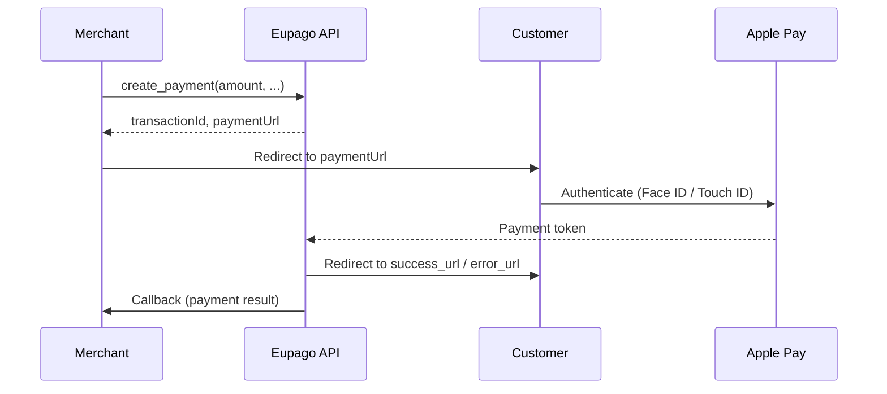

# Apple Pay

## What it is

Apple Pay is a digital wallet payment method that allows customers to pay using their Apple devices (iPhone, iPad, Mac, Apple Watch). Eupago provides a simple single-endpoint integration -- you create a payment and receive a URL where the customer completes the transaction using Apple Pay on a supported device and browser (Safari).

This is a redirect-based flow: the merchant creates a payment, redirects the customer to the Eupago-hosted payment page, and the customer authenticates with Face ID, Touch ID, or their device passcode.

## Flow diagram



## Full example

```python
from decimal import Decimal
from eupago import EupagoClient

client = EupagoClient(api_key="your-api-key")

response = client.apple_pay.create_payment(
    amount=Decimal("15.00"),
    currency="EUR",
    order_id="order-6001",
    callback_url="https://example.com/callback",
    success_url="https://example.com/success",
    error_url="https://example.com/error",
)

print(response.transaction_id)  # "eupago-xxxx-xxxx"
print(response.payment_url)     # "https://sandbox.eupago.pt/pay/xxxx"
# Redirect the customer to response.payment_url
```

## Parameters

### `create_payment`

| Parameter      | Type      | Required | Description                                                    |
|----------------|-----------|----------|----------------------------------------------------------------|
| `amount`       | `Decimal` | Yes      | Amount to charge                                               |
| `currency`     | `str`     | No       | ISO 4217 currency code. Default: `"EUR"`                       |
| `order_id`     | `str`     | No       | Your internal order identifier                                 |
| `callback_url` | `str`     | No       | URL to receive the payment result notification                 |
| `success_url`  | `str`     | No       | URL to redirect the customer after successful payment          |
| `error_url`    | `str`     | No       | URL to redirect the customer after failed payment              |

## Response

### `create_payment` response

| Field            | Type   | Description                                          |
|------------------|--------|------------------------------------------------------|
| `transaction_id` | `str`  | Unique Eupago transaction identifier                 |
| `payment_url`    | `str`  | URL to redirect the customer for Apple Pay checkout  |
| `status`         | `str`  | Initial status: `"pending"`                          |
| `method`         | `str`  | Always `"apple_pay"`                                 |
| `message`        | `str`  | Human-readable status description                    |

## Async variant

The method is available as a coroutine through `AsyncEupagoClient`:

```python
import asyncio
from decimal import Decimal
from eupago import AsyncEupagoClient

async def main():
    client = AsyncEupagoClient(api_key="your-api-key")

    response = await client.apple_pay.create_payment(
        amount=Decimal("15.00"),
        order_id="order-6001",
        callback_url="https://example.com/callback",
        success_url="https://example.com/success",
        error_url="https://example.com/error",
    )

    print(response.payment_url)  # Redirect customer here

asyncio.run(main())
```

## Notes

- Apple Pay requires the customer to use a supported Apple device with Safari. On non-Apple devices, the payment page will not display the Apple Pay option.
- The `success_url` and `error_url` control where the customer is redirected after the payment flow. Always rely on the `callback_url` for definitive payment status, as the redirect alone does not guarantee payment success.
- Apple Pay transactions are processed as card-not-present payments and benefit from the strong customer authentication provided by Face ID, Touch ID, or the device passcode.
- There is no separate authorization + capture flow for Apple Pay -- all payments are charged immediately upon customer approval.
- Ensure your domain is properly configured with Eupago for Apple Pay to work. This may require domain verification through Apple's merchant setup process, which Eupago handles on your behalf.
