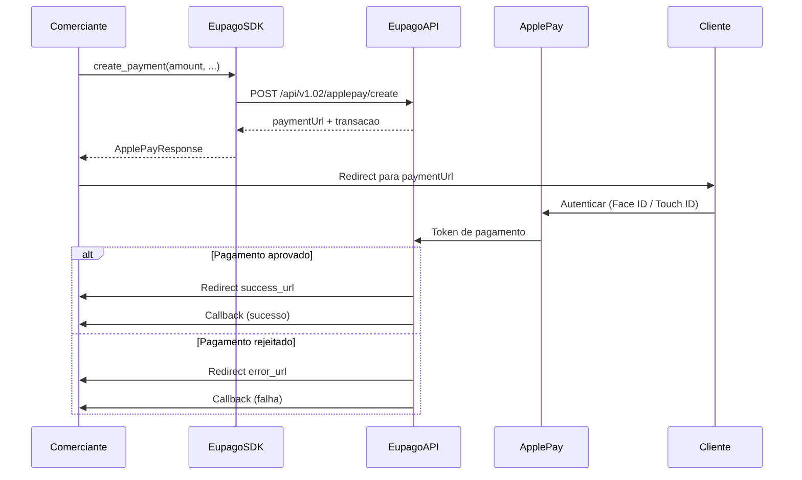

# Apple Pay

## O que e

Apple Pay e um metodo de pagamento digital da Apple que permite aos clientes pagar de forma rapida e segura usando dispositivos Apple (iPhone, iPad, Mac, Apple Watch). A integracao com a euPago gera um URL de pagamento que apresenta a opcao Apple Pay ao cliente. E um fluxo simples com apenas um endpoint.

- **Dispositivos suportados:** iPhone, iPad, Mac, Apple Watch
- **Autenticacao:** Face ID, Touch ID ou codigo do dispositivo
- **Fluxo:** Redirect para pagina de pagamento

## Diagrama de fluxo



## Exemplo completo

```python
from decimal import Decimal
from eupago import EupagoClient

client = EupagoClient(
    api_key="demo-api-key",
    sandbox=True,
)

# Criar pagamento Apple Pay
response = client.apple_pay.create_payment(
    amount=Decimal("39.99"),
    transaction_key="order-12345",
    success_url="https://example.com/success",
    error_url="https://example.com/error",
    callback_url="https://example.com/callback",
    description="Compra na Loja XYZ",
    language="pt",
)

print(f"URL de pagamento: {response.payment_url}")
print(f"Transacao: {response.transaction_id}")
print(f"Estado: {response.status}")

# Redirecionar o cliente para response.payment_url
```

## Parametros

### `create_payment`

| Parametro         | Tipo      | Obrigatorio | Descricao                                                    |
| ----------------- | --------- | ----------- | ------------------------------------------------------------ |
| `amount`          | `Decimal` | Sim         | Montante a cobrar                                            |
| `transaction_key` | `str`     | Sim         | Identificador unico da transacao no sistema do comerciante   |
| `success_url`     | `str`     | Sim         | URL de redirect apos pagamento aprovado                      |
| `error_url`       | `str`     | Sim         | URL de redirect apos pagamento rejeitado                     |
| `callback_url`    | `str`     | Sim         | URL para receber notificacoes de estado do pagamento         |
| `description`     | `str`     | Nao         | Descricao do pagamento visivel para o cliente                |
| `language`        | `str`     | Nao         | Idioma da pagina de pagamento (`"pt"`, `"en"`, `"es"`)       |

## Resposta

```python
{
    "status": "ok",
    "payment_url": "https://pay.eupago.pt/apple/abc123",
    "transaction_id": "txn_ap_12345",
    "method": "applepay",
    "amount": "39.99",
    "currency": "EUR",
}
```

| Campo            | Tipo  | Descricao                                              |
| ---------------- | ----- | ------------------------------------------------------ |
| `status`         | `str` | Estado do pedido: `"ok"` ou `"error"`                  |
| `payment_url`    | `str` | URL para redirecionar o cliente (pagina Apple Pay)     |
| `transaction_id` | `str` | Identificador unico da transacao na euPago             |
| `method`         | `str` | Metodo de pagamento utilizado (`"applepay"`)           |
| `amount`         | `str` | Montante do pagamento                                  |
| `currency`       | `str` | Moeda (`"EUR"`)                                        |

## Variante async

```python
import asyncio
from decimal import Decimal
from eupago import AsyncEupagoClient

async def main():
    client = AsyncEupagoClient(
        api_key="demo-api-key",
        sandbox=True,
    )

    response = await client.apple_pay.create_payment(
        amount=Decimal("39.99"),
        transaction_key="order-12345",
        success_url="https://example.com/success",
        error_url="https://example.com/error",
        callback_url="https://example.com/callback",
        description="Compra na Loja XYZ",
    )

    print(f"URL: {response.payment_url}")
    print(f"Transacao: {response.transaction_id}")

    await client.close()

asyncio.run(main())
```

## Notas

1. **Compatibilidade de dispositivos:** Apple Pay apenas funciona em dispositivos Apple com o Wallet configurado. Certifique-se de oferecer metodos de pagamento alternativos para clientes sem dispositivos Apple.

2. **URLs obrigatorias:** As tres URLs (`success_url`, `error_url`, `callback_url`) sao fundamentais para o fluxo. O `success_url` e `error_url` controlam o redirect do cliente apos o pagamento. O `callback_url` recebe a confirmacao server-to-server.

3. **Seguranca:** O Apple Pay utiliza tokenizacao, pelo que os dados reais do cartao nunca sao partilhados com o comerciante nem com a euPago. A autenticacao biometrica (Face ID/Touch ID) garante seguranca adicional.

4. **Experiencia do utilizador:** O pagamento com Apple Pay e tipicamente mais rapido do que o pagamento com cartao de credito tradicional, pois nao requer a introducao manual dos dados do cartao.

5. **Callback:** Nao confie apenas no redirect para confirmar o pagamento. O redirect pode falhar (ex: o cliente fecha o browser). Use sempre o `callback_url` para confirmacao definitiva do estado do pagamento.

6. **Ambiente sandbox:** Em sandbox, o pagamento Apple Pay e simulado. Nao e necessario ter um dispositivo Apple real para testar a integracao.
