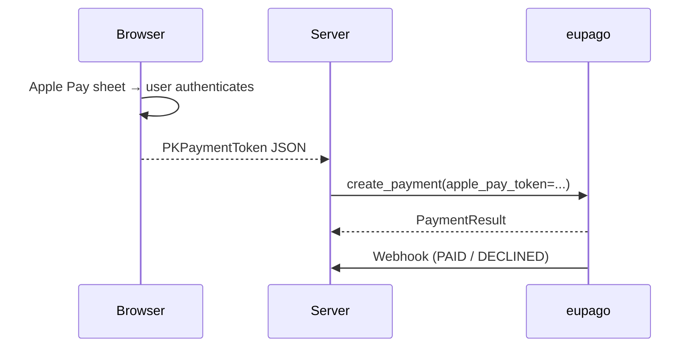

# Apple Pay

## What it is

Apple Wallet payment for iOS apps and Safari on iOS/macOS. The Apple Pay
sheet returns a `PKPaymentToken` JSON once the user picks a card and
authenticates with Face ID / Touch ID. The server forwards the token to
eupago, which decrypts it server-side and processes the card payment.

## Prerequisites

- Apple Developer account with an Apple Pay Merchant ID.
- Domain verification for the eupago Apple Pay flow (see eupago's setup
  guide).
- A real Wallet-enabled device for live verification.

## Flow



## Example

```python
from decimal import Decimal
from eupago import EupagoClient

client = EupagoClient(api_key="...", sandbox=True)

apple_pay_token = '{"paymentMethod": "...", "paymentData": {"version": "EC_v1", ...}}'

payment = client.apple_pay.create_payment(
    order_id="ORD-AP-001",
    amount=Decimal("39.90"),
    apple_pay_token=apple_pay_token,
)
```

## Refund

```python
client.refunds.refund(
    transaction_id=payment.transaction_id,
    value=Decimal("39.90"),
)
```

See [Refunds](refund.md) for OAuth setup.

## Notes

- The SDK never inspects the token — it is treated as opaque payload
  forwarded to eupago's `payment.applePayToken` field.
- Body shape mirrors the verified v1.02 credit-card contract.
- See the runnable
  [`09_apple_pay.py`](https://github.com/bilouro/eupago-python/blob/main/examples/09_apple_pay.py).
