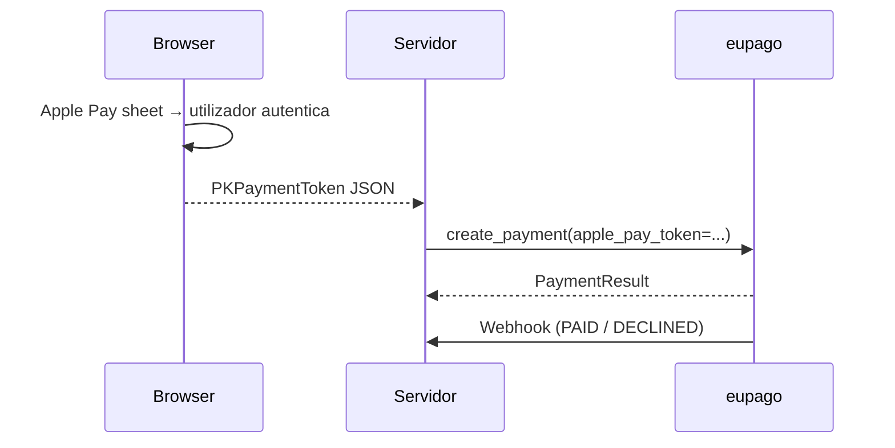

# Apple Pay

## O que é

Pagamento via Apple Wallet em apps iOS e Safari (iOS/macOS). A Apple Pay
sheet devolve um JSON `PKPaymentToken` depois do utilizador escolher o
cartão e se autenticar com Face ID / Touch ID. O servidor encaminha o
token para o eupago, que o desencripta e processa o pagamento.

## Pré-requisitos

- Conta Apple Developer com Apple Pay Merchant ID.
- Verificação de domínio do fluxo Apple Pay do eupago.
- Dispositivo real com Wallet ativa para verificação live.

## Fluxo



## Exemplo

```python
from decimal import Decimal
from eupago import EupagoClient

client = EupagoClient(api_key="...", sandbox=True)

apple_pay_token = '{"paymentMethod": "...", "paymentData": {"version": "EC_v1", ...}}'

payment = client.apple_pay.create_payment(
    order_id="ORD-AP-001",
    amount=Decimal("39.90"),
    apple_pay_token=apple_pay_token,
)
```

## Reembolso

```python
client.refunds.refund(
    transaction_id=payment.transaction_id,
    value=Decimal("39.90"),
)
```

Ver [Refunds](refund.md) para a configuração OAuth.

## Notas

- O SDK nunca inspeciona o token — é tratado como payload opaco
  encaminhado para o campo `payment.applePayToken` do eupago.
- O shape do corpo segue o contrato v1.02 do cartão de crédito.
- Vê o script runnable
  [`09_apple_pay.py`](https://github.com/bilouro/eupago-python/blob/main/examples/09_apple_pay.py).
