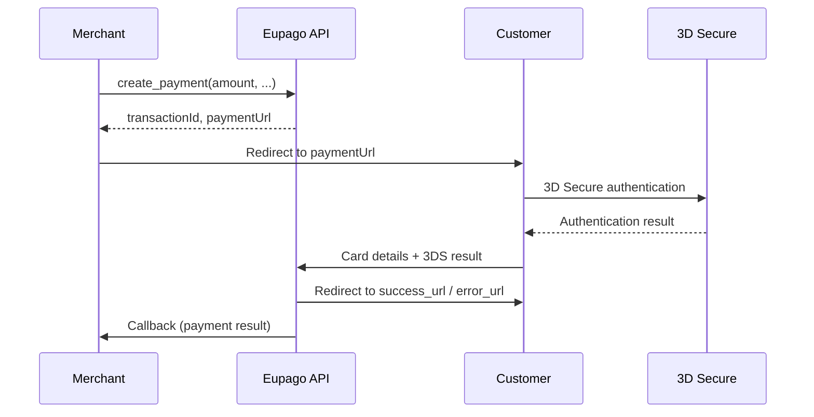
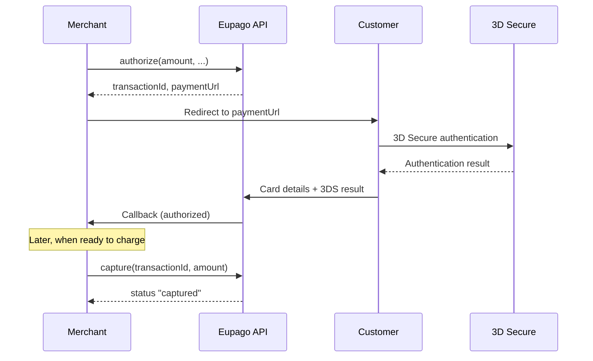
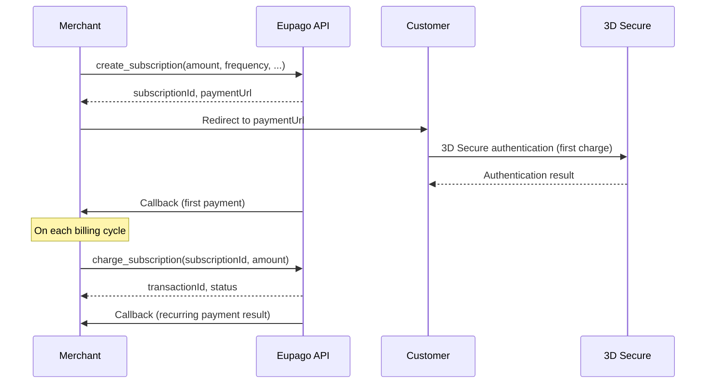

# Credit Card

## What it is

Credit Card payments through Eupago use **3D Secure** authentication for all transactions. When a payment is initiated, the API returns a `paymentUrl` where the customer must be redirected to complete the 3D Secure challenge and enter their card details.

Three flows are supported:

- **Direct payment** -- a single call that charges the customer immediately after 3D Secure authentication.
- **Authorization + Capture** -- a two-step flow where the amount is reserved first and captured later.
- **Subscriptions** -- create a recurring subscription and charge it on a schedule.

The maximum amount per transaction is **3,999 EUR**.

## Flow diagram

### Direct payment



### Authorization + Capture



### Subscriptions



## Full example

### Direct payment

```python
from decimal import Decimal
from eupago import EupagoClient

client = EupagoClient(api_key="your-api-key")

response = client.credit_card.create_payment(
    amount=Decimal("29.99"),
    currency="EUR",
    order_id="order-4001",
    callback_url="https://example.com/callback",
    success_url="https://example.com/success",
    error_url="https://example.com/error",
    cancel_url="https://example.com/cancel",
    language="en",
)

print(response.transaction_id)  # "eupago-xxxx-xxxx"
print(response.payment_url)     # "https://sandbox.eupago.pt/pay/xxxx"
# Redirect the customer to response.payment_url
```

### Authorization + Capture

```python
from decimal import Decimal
from eupago import EupagoClient

client = EupagoClient(api_key="your-api-key")

# Step 1: Authorize
auth = client.credit_card.authorize(
    amount=Decimal("199.00"),
    currency="EUR",
    order_id="order-4002",
    callback_url="https://example.com/callback",
    success_url="https://example.com/success",
    error_url="https://example.com/error",
)

print(auth.payment_url)  # Redirect customer here for 3DS

# Step 2: Capture (after authorization callback is received)
capture = client.credit_card.capture(
    transaction_id=auth.transaction_id,
    amount=Decimal("199.00"),
)

print(capture.status)  # "captured"
```

### Subscriptions

```python
from decimal import Decimal
from eupago import EupagoClient

client = EupagoClient(api_key="your-api-key")

# Step 1: Create subscription (first charge via redirect)
subscription = client.credit_card.create_subscription(
    amount=Decimal("9.99"),
    frequency="monthly",
    currency="EUR",
    order_id="sub-5001",
    callback_url="https://example.com/callback",
    success_url="https://example.com/success",
    error_url="https://example.com/error",
)

print(subscription.subscription_id)  # "sub-xxxx-xxxx"
print(subscription.payment_url)       # Redirect customer here

# Step 2: Charge on subsequent billing cycles
charge = client.credit_card.charge_subscription(
    subscription_id=subscription.subscription_id,
    amount=Decimal("9.99"),
    order_id="sub-5001-month2",
)

print(charge.transaction_id)
print(charge.status)  # "captured"
```

## Parameters

### `create_payment`

| Parameter      | Type      | Required | Description                                                    |
|----------------|-----------|----------|----------------------------------------------------------------|
| `amount`       | `Decimal` | Yes      | Amount to charge (max 3,999 EUR)                               |
| `currency`     | `str`     | No       | ISO 4217 currency code. Default: `"EUR"`                       |
| `order_id`     | `str`     | No       | Your internal order identifier                                 |
| `callback_url` | `str`     | No       | URL to receive the payment result notification                 |
| `success_url`  | `str`     | No       | URL to redirect the customer after successful payment          |
| `error_url`    | `str`     | No       | URL to redirect the customer after failed payment              |
| `cancel_url`   | `str`     | No       | URL to redirect the customer if they cancel the payment        |
| `language`     | `str`     | No       | Payment page language (`"pt"`, `"en"`, `"es"`, `"fr"`)         |

### `authorize`

| Parameter      | Type      | Required | Description                                                    |
|----------------|-----------|----------|----------------------------------------------------------------|
| `amount`       | `Decimal` | Yes      | Amount to authorize (max 3,999 EUR)                            |
| `currency`     | `str`     | No       | ISO 4217 currency code. Default: `"EUR"`                       |
| `order_id`     | `str`     | No       | Your internal order identifier                                 |
| `callback_url` | `str`     | No       | URL to receive the authorization result notification           |
| `success_url`  | `str`     | No       | URL to redirect the customer after successful authorization    |
| `error_url`    | `str`     | No       | URL to redirect the customer after failed authorization        |

### `capture`

| Parameter        | Type      | Required | Description                                            |
|------------------|-----------|----------|--------------------------------------------------------|
| `transaction_id` | `str`     | Yes      | Transaction ID returned by `authorize`                 |
| `amount`         | `Decimal` | Yes      | Amount to capture (must be <= authorized amount)       |

### `create_subscription`

| Parameter      | Type      | Required | Description                                                    |
|----------------|-----------|----------|----------------------------------------------------------------|
| `amount`       | `Decimal` | Yes      | Recurring amount to charge (max 3,999 EUR)                     |
| `frequency`    | `str`     | Yes      | Billing frequency: `"monthly"`, `"quarterly"`, `"yearly"`      |
| `currency`     | `str`     | No       | ISO 4217 currency code. Default: `"EUR"`                       |
| `order_id`     | `str`     | No       | Your internal order identifier                                 |
| `callback_url` | `str`     | No       | URL to receive payment notifications                           |
| `success_url`  | `str`     | No       | URL to redirect the customer after successful first payment    |
| `error_url`    | `str`     | No       | URL to redirect the customer after failed first payment        |

### `charge_subscription`

| Parameter         | Type      | Required | Description                                           |
|-------------------|-----------|----------|-------------------------------------------------------|
| `subscription_id` | `str`     | Yes      | Subscription ID returned by `create_subscription`     |
| `amount`          | `Decimal` | Yes      | Amount to charge for this billing cycle                |
| `order_id`        | `str`     | No       | Your internal order identifier for this charge         |

## Response

### `create_payment` / `authorize` response

| Field            | Type   | Description                                   |
|------------------|--------|-----------------------------------------------|
| `transaction_id` | `str`  | Unique Eupago transaction identifier          |
| `payment_url`    | `str`  | URL to redirect the customer for 3D Secure    |
| `status`         | `str`  | Initial status: `"pending"`                   |
| `method`         | `str`  | Always `"credit_card"`                        |
| `message`        | `str`  | Human-readable status description             |

### `capture` response

| Field            | Type   | Description                                   |
|------------------|--------|-----------------------------------------------|
| `transaction_id` | `str`  | Unique Eupago transaction identifier          |
| `status`         | `str`  | `"captured"` or `"failed"`                    |
| `method`         | `str`  | Always `"credit_card"`                        |
| `message`        | `str`  | Human-readable status description             |

### `create_subscription` response

| Field             | Type   | Description                                  |
|-------------------|--------|----------------------------------------------|
| `subscription_id` | `str`  | Unique subscription identifier               |
| `payment_url`     | `str`  | URL to redirect the customer for first charge|
| `status`          | `str`  | Initial status: `"pending"`                  |
| `method`          | `str`  | Always `"credit_card"`                       |
| `message`         | `str`  | Human-readable status description            |

### `charge_subscription` response

| Field            | Type   | Description                                   |
|------------------|--------|-----------------------------------------------|
| `transaction_id` | `str`  | Unique Eupago transaction identifier          |
| `status`         | `str`  | `"captured"` or `"failed"`                    |
| `method`         | `str`  | Always `"credit_card"`                        |
| `message`        | `str`  | Human-readable status description             |

## Async variant

All methods are available as coroutines through `AsyncEupagoClient`:

```python
import asyncio
from decimal import Decimal
from eupago import AsyncEupagoClient

async def main():
    client = AsyncEupagoClient(api_key="your-api-key")

    response = await client.credit_card.create_payment(
        amount=Decimal("29.99"),
        order_id="order-4001",
        callback_url="https://example.com/callback",
        success_url="https://example.com/success",
        error_url="https://example.com/error",
    )

    print(response.payment_url)  # Redirect customer here

asyncio.run(main())
```

## Notes

- All credit card transactions use **3D Secure** authentication. The customer must be redirected to the `paymentUrl` to complete the payment.
- The maximum amount per transaction is **3,999 EUR**.
- For testing in the sandbox environment, use the test card number **4018810000150015** with CVV **0101** and any future expiration date.
- The `success_url` and `error_url` are where the customer is redirected after the 3D Secure flow -- they indicate the customer's redirect destination, not the final payment status. Always rely on the `callback_url` for definitive payment confirmation.
- When using authorization + capture, the captured amount can be less than or equal to the authorized amount.
- Subscription charges after the first payment do not require 3D Secure redirection, as the card is already tokenized from the initial authorization.
- The `frequency` parameter in `create_subscription` defines the billing cycle but does not automatically trigger charges. You must call `charge_subscription` on each billing date.
