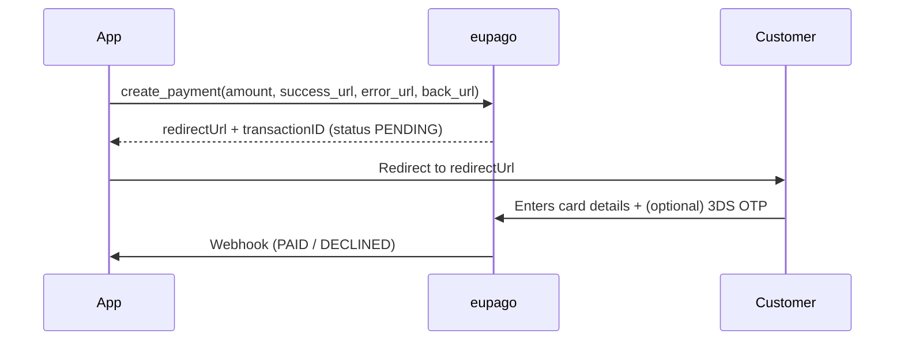

# Credit Card

## What it is

Hosted credit/debit card payment with 3D-Secure / OTP. The customer is
redirected to eupago's hosted form to enter the card details and (when the
card or the amount requires it) complete the challenge. The final outcome
arrives via webhook.

The same service covers three flows:

- **`create_payment`** — single one-shot charge.
- **`authorize` + `capture`** — reserve now, charge later.
- **`create_subscription` + `charge_subscription`** — register a card once,
  then charge it from the server on demand.

The maximum amount per transaction is **3,999 EUR**.

## Flow



## Example — one-shot

```python
from decimal import Decimal
from eupago import EupagoClient
from eupago.models import Customer

client = EupagoClient(api_key="...", sandbox=True)

payment = client.credit_card.create_payment(
    order_id="ORD-CC-001",
    amount=Decimal("249.90"),
    success_url="https://shop.example.com/ok",
    error_url="https://shop.example.com/fail",
    back_url="https://shop.example.com/cart",
    customer=Customer(email="customer@example.com"),
)

# Redirect the customer to payment.payment_url and wait for the webhook
```

**Sandbox test card:** `4018810000150015` (Visa) — OTP `0101` succeeds,
`3333` fails. Amounts above 500 EUR trigger the OTP prompt.

## Example — authorize + capture

```python
auth = client.credit_card.authorize(
    order_id="ORD-CC-AUTH-001",
    amount=Decimal("100.00"),
    success_url="...", error_url="...", back_url="...",
)

# Later, when the goods ship — capture requires the amount and the same
# return URLs (eupago rejects an empty body with AMOUNT_MISSING).
captured = client.credit_card.capture(
    transaction_id=auth.transaction_id,
    amount=Decimal("100.00"),
    success_url="...", error_url="...", back_url="...",
)
```

!!! warning "Channel capability"
    `authorize` + `capture` need the eupago channel to have **Credit Card
    Auth & Capture** provisioned (a separate feature beyond plain Credit
    Card). On a vanilla demo channel the form posts to the merchant
    `errorUrl` and capture returns `PAYMENT_NOT_CAPTIVE`. Ask eupago
    support to enable the feature on your channel.

## Example — subscription

```python
sub = client.credit_card.create_subscription(
    order_id="SUB-2026-001",
    amount=Decimal("19.90"),         # the recurring amount
    success_url="...", error_url="...", back_url="...",
    # Optional — defaults to monthly billing on day 1 for 1 year:
    # periodicity="Mensal",
    # collection_day=1,
    # auto_process=False,            # True = eupago bills automatically
    # start_date=date(2026, 6, 1),
    # limit_date=date(2027, 6, 1),
)

# sub.transaction_id is the subscriptionID (32-char hex) — keep it.
subscription_id = sub.transaction_id

# Charge it later (server-to-server, no customer interaction):
client.credit_card.charge_subscription(
    recurrent_id=subscription_id,
    order_id="SUB-2026-001-M01",
    amount=Decimal("19.90"),
    success_url="...", error_url="...", back_url="...",
)
```

!!! warning "Channel capability"
    Subscription endpoints require the channel to have **Credit Card —
    Subscription** provisioned by eupago. Without it, the registration
    form posts to the merchant `errorUrl` and any subsequent
    `charge_subscription` is refused. The SDK send the correct body
    (verified against the readme.io spec); enable the feature in the
    backoffice or via support.

## Refund

```python
client.refunds.refund(
    transaction_id=payment.transaction_id,
    value=Decimal("249.90"),
)
```

See [Refunds](refund.md) for OAuth setup.

## Notes

- All three return URLs (`success_url`, `error_url`, `back_url`) are
  required by the API for `create_payment`, `authorize`, and
  `create_subscription`.
- Subscriptions store the card token on eupago's side; subsequent charges
  do not require customer interaction.
- See the runnable
  [`07_credit_card_payment.py`](https://github.com/bilouro/eupago-python/blob/main/examples/07_credit_card_payment.py)
  and
  [`08_credit_card_subscription.py`](https://github.com/bilouro/eupago-python/blob/main/examples/08_credit_card_subscription.py)
  for the full lifecycle.
