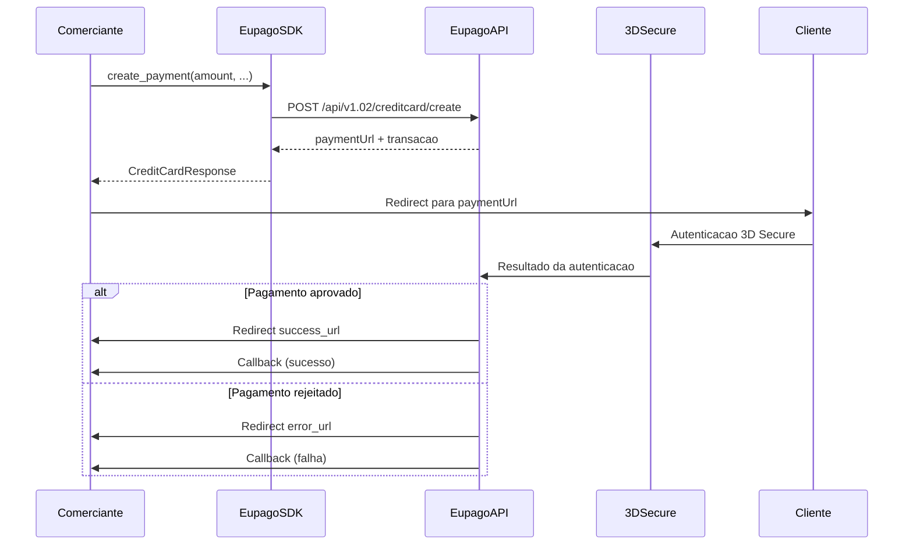
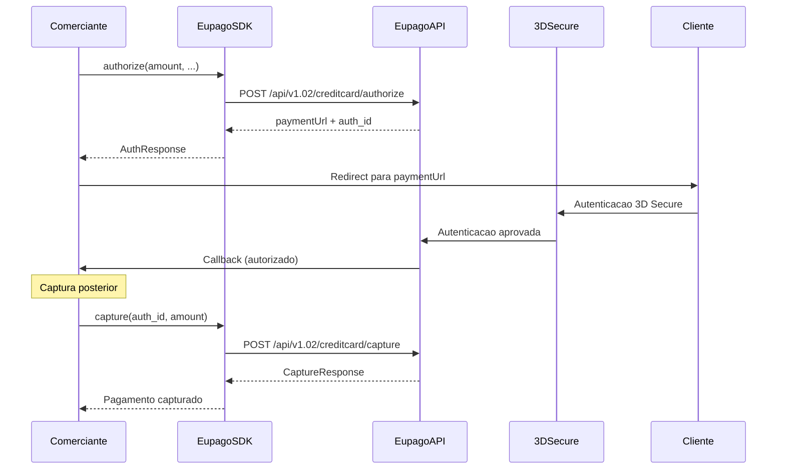
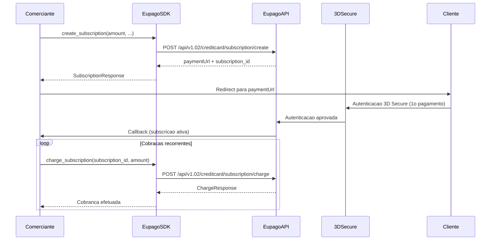

# Cartao de Credito

## O que e

O pagamento por cartao de credito na euPago utiliza **3D Secure** para autenticacao do titular. O SDK gera um `paymentUrl` para o qual o cliente e redirecionado para completar o pagamento de forma segura. Suporta tres fluxos: pagamento direto, autorizacao + captura, e subscricoes recorrentes.

- **Montante maximo:** 3.999 EUR
- **Autenticacao:** 3D Secure obrigatoria
- **Cartao de teste:** `4018810000150015`, CVV `0101`

## Diagrama de fluxo

### Pagamento direto



### Autorizacao + Captura



### Subscricoes



## Exemplo completo

### Pagamento direto

```python
from decimal import Decimal
from eupago import EupagoClient

client = EupagoClient(
    api_key="demo-api-key",
    sandbox=True,
)

# Pagamento direto com cartao de credito
response = client.credit_card.create_payment(
    amount=Decimal("49.99"),
    transaction_key="order-12345",
    success_url="https://example.com/success",
    error_url="https://example.com/error",
    callback_url="https://example.com/callback",
    language="pt",
)

print(f"URL de pagamento: {response.payment_url}")
print(f"Transacao: {response.transaction_id}")
# Redirecionar o cliente para response.payment_url
```

### Autorizacao + Captura

```python
from decimal import Decimal
from eupago import EupagoClient

client = EupagoClient(
    api_key="demo-api-key",
    sandbox=True,
)

# Passo 1: Autorizar
auth_response = client.credit_card.authorize(
    amount=Decimal("99.99"),
    transaction_key="order-67890",
    success_url="https://example.com/success",
    error_url="https://example.com/error",
    callback_url="https://example.com/callback",
)

print(f"URL de autenticacao: {auth_response.payment_url}")
print(f"Auth ID: {auth_response.authorization_id}")
# Redirecionar o cliente para auth_response.payment_url

# Passo 2: Capturar (apos confirmacao via callback)
capture_response = client.credit_card.capture(
    authorization_id=auth_response.authorization_id,
    amount=Decimal("99.99"),
)

print(f"Captura: {capture_response.status}")
print(f"Transacao: {capture_response.transaction_id}")
```

### Subscricoes

```python
from decimal import Decimal
from eupago import EupagoClient

client = EupagoClient(
    api_key="demo-api-key",
    sandbox=True,
)

# Passo 1: Criar subscricao (primeiro pagamento com 3D Secure)
sub_response = client.credit_card.create_subscription(
    amount=Decimal("29.99"),
    transaction_key="sub-12345",
    success_url="https://example.com/success",
    error_url="https://example.com/error",
    callback_url="https://example.com/callback",
    frequency="monthly",
)

print(f"URL de pagamento: {sub_response.payment_url}")
print(f"Subscription ID: {sub_response.subscription_id}")
# Redirecionar o cliente para sub_response.payment_url

# Passo 2: Cobrar subscricao (pagamentos seguintes, sem 3D Secure)
charge_response = client.credit_card.charge_subscription(
    subscription_id=sub_response.subscription_id,
    amount=Decimal("29.99"),
    transaction_key="sub-12345-month2",
)

print(f"Cobranca: {charge_response.status}")
print(f"Transacao: {charge_response.transaction_id}")
```

## Parametros

### `create_payment`

| Parametro         | Tipo      | Obrigatorio | Descricao                                                    |
| ----------------- | --------- | ----------- | ------------------------------------------------------------ |
| `amount`          | `Decimal` | Sim         | Montante a cobrar (max: 3.999 EUR)                           |
| `transaction_key` | `str`     | Sim         | Identificador unico da transacao no sistema do comerciante   |
| `success_url`     | `str`     | Sim         | URL de redirect apos pagamento aprovado                      |
| `error_url`       | `str`     | Sim         | URL de redirect apos pagamento rejeitado                     |
| `callback_url`    | `str`     | Nao         | URL para receber notificacoes de estado                      |
| `language`        | `str`     | Nao         | Idioma da pagina de pagamento (`"pt"`, `"en"`, `"es"`)       |
| `description`     | `str`     | Nao         | Descricao do pagamento                                       |

### `authorize`

| Parametro         | Tipo      | Obrigatorio | Descricao                                                    |
| ----------------- | --------- | ----------- | ------------------------------------------------------------ |
| `amount`          | `Decimal` | Sim         | Montante a pre-autorizar (max: 3.999 EUR)                    |
| `transaction_key` | `str`     | Sim         | Identificador unico da transacao no sistema do comerciante   |
| `success_url`     | `str`     | Sim         | URL de redirect apos autorizacao aprovada                    |
| `error_url`       | `str`     | Sim         | URL de redirect apos autorizacao rejeitada                   |
| `callback_url`    | `str`     | Nao         | URL para receber notificacoes de estado                      |

### `capture`

| Parametro          | Tipo      | Obrigatorio | Descricao                                                  |
| ------------------ | --------- | ----------- | ---------------------------------------------------------- |
| `authorization_id` | `str`     | Sim         | ID da autorizacao obtido no passo `authorize`              |
| `amount`           | `Decimal` | Sim         | Montante a capturar (pode ser inferior ao autorizado)      |

### `create_subscription`

| Parametro         | Tipo      | Obrigatorio | Descricao                                                    |
| ----------------- | --------- | ----------- | ------------------------------------------------------------ |
| `amount`          | `Decimal` | Sim         | Montante do primeiro pagamento (max: 3.999 EUR)              |
| `transaction_key` | `str`     | Sim         | Identificador unico da subscricao                            |
| `success_url`     | `str`     | Sim         | URL de redirect apos pagamento aprovado                      |
| `error_url`       | `str`     | Sim         | URL de redirect apos pagamento rejeitado                     |
| `callback_url`    | `str`     | Nao         | URL para receber notificacoes de estado                      |
| `frequency`       | `str`     | Nao         | Frequencia da subscricao (`"monthly"`, `"yearly"`, etc.)     |

### `charge_subscription`

| Parametro         | Tipo      | Obrigatorio | Descricao                                                    |
| ----------------- | --------- | ----------- | ------------------------------------------------------------ |
| `subscription_id` | `str`     | Sim         | ID da subscricao obtido em `create_subscription`             |
| `amount`          | `Decimal` | Sim         | Montante a cobrar nesta recorrencia                          |
| `transaction_key` | `str`     | Sim         | Identificador unico desta cobranca                           |

## Resposta

### Resposta de `create_payment` / `authorize`

```python
{
    "status": "ok",
    "payment_url": "https://pay.eupago.pt/ccrd/abc123",
    "transaction_id": "txn_cc_12345",
    "method": "creditcard",
    "amount": "49.99",
    "currency": "EUR",
}
```

### Resposta de `capture`

```python
{
    "status": "ok",
    "transaction_id": "txn_cc_12345",
    "amount": "99.99",
    "captured": True,
}
```

### Resposta de `create_subscription`

```python
{
    "status": "ok",
    "payment_url": "https://pay.eupago.pt/ccrd/sub456",
    "subscription_id": "sub_12345",
    "transaction_id": "txn_cc_67890",
    "amount": "29.99",
    "currency": "EUR",
    "frequency": "monthly",
}
```

| Campo             | Tipo   | Descricao                                                |
| ----------------- | ------ | -------------------------------------------------------- |
| `status`          | `str`  | Estado do pedido: `"ok"` ou `"error"`                    |
| `payment_url`     | `str`  | URL para redirecionar o cliente (pagina de pagamento)    |
| `transaction_id`  | `str`  | Identificador unico da transacao na euPago               |
| `subscription_id` | `str`  | Identificador da subscricao (apenas em subscricoes)      |
| `amount`          | `str`  | Montante do pagamento                                    |
| `currency`        | `str`  | Moeda (`"EUR"`)                                          |

## Variante async

```python
import asyncio
from decimal import Decimal
from eupago import AsyncEupagoClient

async def main():
    client = AsyncEupagoClient(
        api_key="demo-api-key",
        sandbox=True,
    )

    # Pagamento direto
    response = await client.credit_card.create_payment(
        amount=Decimal("49.99"),
        transaction_key="order-12345",
        success_url="https://example.com/success",
        error_url="https://example.com/error",
        callback_url="https://example.com/callback",
    )

    print(f"URL: {response.payment_url}")

    # Subscricao
    sub = await client.credit_card.create_subscription(
        amount=Decimal("29.99"),
        transaction_key="sub-async-001",
        success_url="https://example.com/success",
        error_url="https://example.com/error",
    )

    print(f"Subscription ID: {sub.subscription_id}")

    # Cobranca recorrente
    charge = await client.credit_card.charge_subscription(
        subscription_id=sub.subscription_id,
        amount=Decimal("29.99"),
        transaction_key="sub-async-001-month2",
    )

    print(f"Cobranca: {charge.status}")

    await client.close()

asyncio.run(main())
```

## Notas

1. **3D Secure obrigatorio:** Todos os pagamentos com cartao de credito requerem autenticacao 3D Secure. O cliente e redirecionado para a pagina do banco para autenticacao antes do pagamento ser processado.

2. **Montante maximo:** O limite por transacao e de 3.999 EUR, significativamente inferior ao MB WAY e Multibanco. Para montantes superiores, considere metodos de pagamento alternativos.

3. **URLs de redirect:** As URLs `success_url` e `error_url` sao obrigatorias. Apos o pagamento, o cliente e redirecionado para a URL apropriada. Nao confie apenas no redirect para confirmar o pagamento; use sempre o callback.

4. **Cartao de teste:** Em ambiente sandbox, use o cartao `4018810000150015` com CVV `0101` para simular pagamentos aprovados. Outros cartoes de teste podem estar disponiveis na documentacao da euPago.

5. **Subscricoes:** O primeiro pagamento de uma subscricao requer autenticacao 3D Secure. Os pagamentos seguintes (via `charge_subscription`) sao processados automaticamente sem interacao do cliente.

6. **Captura parcial:** No fluxo de autorizacao + captura, e possivel capturar um montante inferior ao autorizado. Isto e util quando o montante final pode variar (ex: encomendas com peso variavel).

7. **Payment URL:** O `paymentUrl` retornado tem validade limitada. Redirecione o cliente o mais rapido possivel apos receber a resposta.
