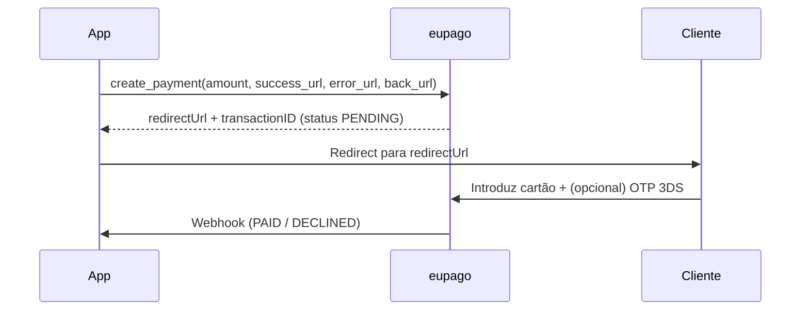

# Cartão de Crédito

## O que é

Pagamento de cartão de crédito/débito alojado com 3D-Secure / OTP. O cliente
é redirecionado para a página da eupago para introduzir os dados do cartão
e (se o cartão ou o valor o exigirem) completar o desafio 3DS. O resultado
chega por webhook.

O mesmo serviço cobre três fluxos:

- **`create_payment`** — cobrança imediata.
- **`authorize` + `capture`** — reservar agora, cobrar depois.
- **`create_subscription` + `charge_subscription`** — registar o cartão
  uma única vez e cobrar do servidor a qualquer momento.

O valor máximo por transação é **3.999 EUR**.

## Fluxo



## Exemplo — pagamento único

```python
from decimal import Decimal
from eupago import EupagoClient
from eupago.models import Customer

client = EupagoClient(api_key="...", sandbox=True)

payment = client.credit_card.create_payment(
    order_id="ORD-CC-001",
    amount=Decimal("249.90"),
    success_url="https://loja.exemplo.pt/ok",
    error_url="https://loja.exemplo.pt/falha",
    back_url="https://loja.exemplo.pt/carrinho",
    customer=Customer(email="cliente@exemplo.pt"),
)

# Redirecciona o cliente para payment.payment_url e aguarda o webhook
```

**Cartão de teste (sandbox):** `4018810000150015` (Visa) — OTP `0101`
sucesso, `3333` falha. Valores acima de 500 EUR despoletam o OTP.

## Exemplo — authorize + capture

```python
auth = client.credit_card.authorize(
    order_id="ORD-CC-AUTH-001",
    amount=Decimal("100.00"),
    success_url="...", error_url="...", back_url="...",
)

# Mais tarde, quando o serviço for prestado:
captured = client.credit_card.capture(transaction_id=auth.transaction_id)
```

## Exemplo — subscrição

```python
sub = client.credit_card.create_subscription(
    order_id="SUB-2026-001",
    amount=Decimal("0.00"),  # 0 = só registo do cartão
    success_url="...", error_url="...", back_url="...",
)

# Após o webhook entregar um recurrent_id:
client.credit_card.charge_subscription(
    recurrent_id=12345,
    order_id="SUB-2026-001-M01",
    amount=Decimal("19.90"),
)
```

## Reembolso

```python
client.refunds.refund(
    transaction_id=payment.transaction_id,
    value=Decimal("249.90"),
)
```

Ver [Refunds](refund.md) para a configuração OAuth.

## Notas

- As três URLs de retorno (`success_url`, `error_url`, `back_url`) são
  exigidas pelo API em `create_payment`, `authorize` e
  `create_subscription`.
- As subscrições guardam o token do cartão do lado da eupago; cobranças
  subsequentes não requerem intervenção do cliente.
- Vê os scripts runnable
  [`07_credit_card_payment.py`](https://github.com/bilouro/eupago-python/blob/main/examples/07_credit_card_payment.py)
  e
  [`08_credit_card_subscription.py`](https://github.com/bilouro/eupago-python/blob/main/examples/08_credit_card_subscription.py)
  para o ciclo completo.
