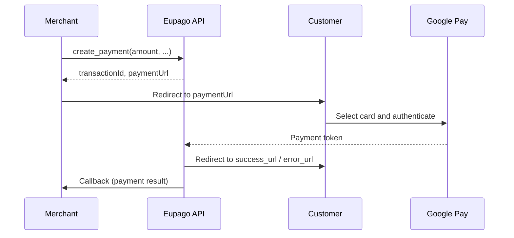

# Google Pay

## What it is

Google Pay is a digital wallet payment method that allows customers to pay using payment credentials stored in their Google account. Eupago provides a simple single-endpoint integration -- you create a payment and receive a URL where the customer completes the transaction using Google Pay on any supported browser or device.

This is a redirect-based flow: the merchant creates a payment, redirects the customer to the Eupago-hosted payment page, and the customer selects a card from their Google account and authenticates.

The maximum amount per transaction is **99,999 EUR**.

## Flow diagram



## Full example

```python
from decimal import Decimal
from eupago import EupagoClient

client = EupagoClient(api_key="your-api-key")

response = client.google_pay.create_payment(
    amount=Decimal("22.50"),
    currency="EUR",
    order_id="order-7001",
    callback_url="https://example.com/callback",
    success_url="https://example.com/success",
    error_url="https://example.com/error",
)

print(response.transaction_id)  # "eupago-xxxx-xxxx"
print(response.payment_url)     # "https://sandbox.eupago.pt/pay/xxxx"
# Redirect the customer to response.payment_url
```

## Parameters

### `create_payment`

| Parameter      | Type      | Required | Description                                                    |
|----------------|-----------|----------|----------------------------------------------------------------|
| `amount`       | `Decimal` | Yes      | Amount to charge (max 99,999 EUR)                              |
| `currency`     | `str`     | No       | ISO 4217 currency code. Default: `"EUR"`                       |
| `order_id`     | `str`     | No       | Your internal order identifier                                 |
| `callback_url` | `str`     | No       | URL to receive the payment result notification                 |
| `success_url`  | `str`     | No       | URL to redirect the customer after successful payment          |
| `error_url`    | `str`     | No       | URL to redirect the customer after failed payment              |

## Response

### `create_payment` response

| Field            | Type   | Description                                           |
|------------------|--------|-------------------------------------------------------|
| `transaction_id` | `str`  | Unique Eupago transaction identifier                  |
| `payment_url`    | `str`  | URL to redirect the customer for Google Pay checkout  |
| `status`         | `str`  | Initial status: `"pending"`                           |
| `method`         | `str`  | Always `"google_pay"`                                 |
| `message`        | `str`  | Human-readable status description                     |

## Async variant

The method is available as a coroutine through `AsyncEupagoClient`:

```python
import asyncio
from decimal import Decimal
from eupago import AsyncEupagoClient

async def main():
    client = AsyncEupagoClient(api_key="your-api-key")

    response = await client.google_pay.create_payment(
        amount=Decimal("22.50"),
        order_id="order-7001",
        callback_url="https://example.com/callback",
        success_url="https://example.com/success",
        error_url="https://example.com/error",
    )

    print(response.payment_url)  # Redirect customer here

asyncio.run(main())
```

## Notes

- Google Pay works across all major browsers (Chrome, Firefox, Safari, Edge) and on Android devices natively. Customers select a card stored in their Google account to complete the payment.
- The maximum amount per transaction is **99,999 EUR**.
- The `success_url` and `error_url` control where the customer is redirected after the payment flow. Always rely on the `callback_url` for definitive payment status, as the redirect alone does not guarantee payment success.
- Google Pay transactions are processed as card-not-present payments. The actual card network (Visa, Mastercard, etc.) depends on the card the customer selects from their Google wallet.
- There is no separate authorization + capture flow for Google Pay -- all payments are charged immediately upon customer approval.
- No additional domain verification is required for Google Pay, unlike Apple Pay. The integration works out of the box once your Eupago account is configured for Google Pay.
