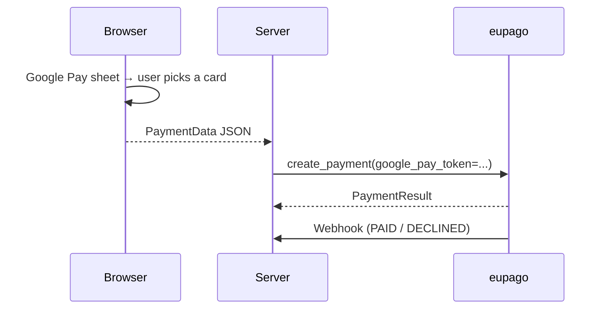

# Google Pay

## What it is

Google Pay payment for Android apps and Chrome browsers. The Google Pay
sheet returns a `PaymentData` JSON once the user picks a card. The server
forwards the token to eupago, which decrypts it and processes the card
payment.

## Prerequisites

- Merchant configured in the Google Pay & Wallet Console.
- A real Google Pay-enabled device for live verification.

## Flow



## Example

```python
from decimal import Decimal
from eupago import EupagoClient

client = EupagoClient(api_key="...", sandbox=True)

google_pay_token = '{"paymentMethodData": {"tokenizationData": {"token": "..."}}}'

payment = client.google_pay.create_payment(
    order_id="ORD-GP-001",
    amount=Decimal("39.90"),
    google_pay_token=google_pay_token,
)
```

## Refund

```python
client.refunds.refund(
    transaction_id=payment.transaction_id,
    value=Decimal("39.90"),
)
```

See [Refunds](refund.md) for OAuth setup.

## Notes

- The SDK never inspects the token — it is forwarded opaquely to
  eupago's `payment.googlePayToken` field.
- Body shape mirrors the verified v1.02 credit-card contract.
- See the runnable
  [`10_google_pay.py`](https://github.com/bilouro/eupago-python/blob/main/examples/10_google_pay.py).
