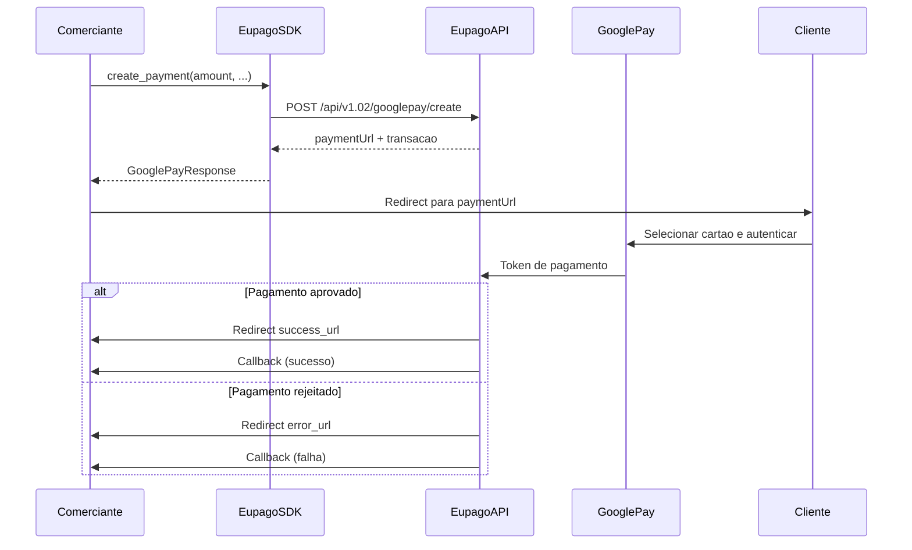

# Google Pay

## O que e

Google Pay e um metodo de pagamento digital da Google que permite aos clientes pagar de forma rapida e segura usando dispositivos Android ou o browser Chrome. A integracao com a euPago gera um URL de pagamento que apresenta a opcao Google Pay ao cliente. Tal como o Apple Pay, e um fluxo simples com apenas um endpoint.

- **Montante maximo:** 99.999 EUR
- **Dispositivos suportados:** Android, Chrome (desktop e mobile)
- **Fluxo:** Redirect para pagina de pagamento

## Diagrama de fluxo



## Exemplo completo

```python
from decimal import Decimal
from eupago import EupagoClient

client = EupagoClient(
    api_key="demo-api-key",
    sandbox=True,
)

# Criar pagamento Google Pay
response = client.google_pay.create_payment(
    amount=Decimal("59.99"),
    transaction_key="order-12345",
    success_url="https://example.com/success",
    error_url="https://example.com/error",
    callback_url="https://example.com/callback",
    description="Compra na Loja XYZ",
    language="pt",
)

print(f"URL de pagamento: {response.payment_url}")
print(f"Transacao: {response.transaction_id}")
print(f"Estado: {response.status}")

# Redirecionar o cliente para response.payment_url
```

## Parametros

### `create_payment`

| Parametro         | Tipo      | Obrigatorio | Descricao                                                    |
| ----------------- | --------- | ----------- | ------------------------------------------------------------ |
| `amount`          | `Decimal` | Sim         | Montante a cobrar (max: 99.999 EUR)                          |
| `transaction_key` | `str`     | Sim         | Identificador unico da transacao no sistema do comerciante   |
| `success_url`     | `str`     | Sim         | URL de redirect apos pagamento aprovado                      |
| `error_url`       | `str`     | Sim         | URL de redirect apos pagamento rejeitado                     |
| `callback_url`    | `str`     | Sim         | URL para receber notificacoes de estado do pagamento         |
| `description`     | `str`     | Nao         | Descricao do pagamento visivel para o cliente                |
| `language`        | `str`     | Nao         | Idioma da pagina de pagamento (`"pt"`, `"en"`, `"es"`)       |

## Resposta

```python
{
    "status": "ok",
    "payment_url": "https://pay.eupago.pt/google/abc123",
    "transaction_id": "txn_gp_12345",
    "method": "googlepay",
    "amount": "59.99",
    "currency": "EUR",
}
```

| Campo            | Tipo  | Descricao                                              |
| ---------------- | ----- | ------------------------------------------------------ |
| `status`         | `str` | Estado do pedido: `"ok"` ou `"error"`                  |
| `payment_url`    | `str` | URL para redirecionar o cliente (pagina Google Pay)    |
| `transaction_id` | `str` | Identificador unico da transacao na euPago             |
| `method`         | `str` | Metodo de pagamento utilizado (`"googlepay"`)          |
| `amount`         | `str` | Montante do pagamento                                  |
| `currency`       | `str` | Moeda (`"EUR"`)                                        |

## Variante async

```python
import asyncio
from decimal import Decimal
from eupago import AsyncEupagoClient

async def main():
    client = AsyncEupagoClient(
        api_key="demo-api-key",
        sandbox=True,
    )

    response = await client.google_pay.create_payment(
        amount=Decimal("59.99"),
        transaction_key="order-12345",
        success_url="https://example.com/success",
        error_url="https://example.com/error",
        callback_url="https://example.com/callback",
        description="Compra na Loja XYZ",
    )

    print(f"URL: {response.payment_url}")
    print(f"Transacao: {response.transaction_id}")

    await client.close()

asyncio.run(main())
```

## Notas

1. **Montante maximo:** O Google Pay suporta transacoes ate 99.999 EUR, o mesmo limite do MB WAY e Multibanco, e significativamente superior ao limite do cartao de credito (3.999 EUR).

2. **Compatibilidade:** O Google Pay funciona em dispositivos Android com a Google Wallet configurada e tambem no browser Chrome (desktop e mobile). Oferece maior cobertura de dispositivos do que o Apple Pay.

3. **URLs obrigatorias:** As tres URLs (`success_url`, `error_url`, `callback_url`) sao necessarias para o fluxo completo. O redirect informa o cliente, mas o callback e a confirmacao definitiva para o comerciante.

4. **Tokenizacao:** O Google Pay utiliza tokenizacao para proteger os dados do cartao. Os dados reais do cartao nunca sao expostos ao comerciante nem a euPago.

5. **Callback:** Tal como nos outros metodos com redirect, nao confie apenas no redirect do browser. O `callback_url` garante que o servidor do comerciante recebe a confirmacao do pagamento, mesmo que o cliente feche o browser antes do redirect.

6. **Ambiente sandbox:** Em sandbox, o pagamento Google Pay e simulado. Nao e necessario ter um dispositivo Android real nem a Google Wallet configurada para testar a integracao.

7. **Fluxo simples:** Ao contrario do cartao de credito, o Google Pay nao suporta autorizacao + captura nem subscricoes. Para esses fluxos, utilize o metodo de cartao de credito.
