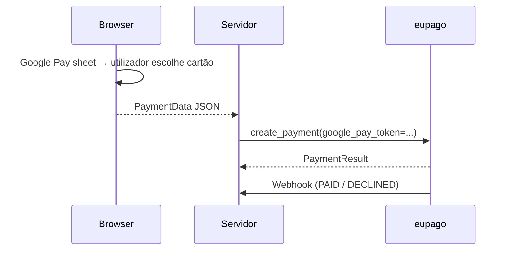

# Google Pay

## O que é

Pagamento Google Pay em apps Android e browsers Chrome. A Google Pay sheet
devolve um JSON `PaymentData` quando o utilizador escolhe um cartão. O
servidor encaminha o token para o eupago, que o desencripta e processa o
pagamento.

## Pré-requisitos

- Merchant configurado na Google Pay & Wallet Console.
- Dispositivo real com Google Pay ativo para verificação live.

## Fluxo



## Exemplo

```python
from decimal import Decimal
from eupago import EupagoClient

client = EupagoClient(api_key="...", sandbox=True)

google_pay_token = '{"paymentMethodData": {"tokenizationData": {"token": "..."}}}'

payment = client.google_pay.create_payment(
    order_id="ORD-GP-001",
    amount=Decimal("39.90"),
    google_pay_token=google_pay_token,
)
```

## Reembolso

```python
client.refunds.refund(
    transaction_id=payment.transaction_id,
    value=Decimal("39.90"),
)
```

Ver [Refunds](refund.md) para a configuração OAuth.

## Notas

- O SDK nunca inspeciona o token — é encaminhado opacamente para o campo
  `payment.googlePayToken` do eupago.
- O shape do corpo segue o contrato v1.02 do cartão de crédito.
- Vê o script runnable
  [`10_google_pay.py`](https://github.com/bilouro/eupago-python/blob/main/examples/10_google_pay.py).
