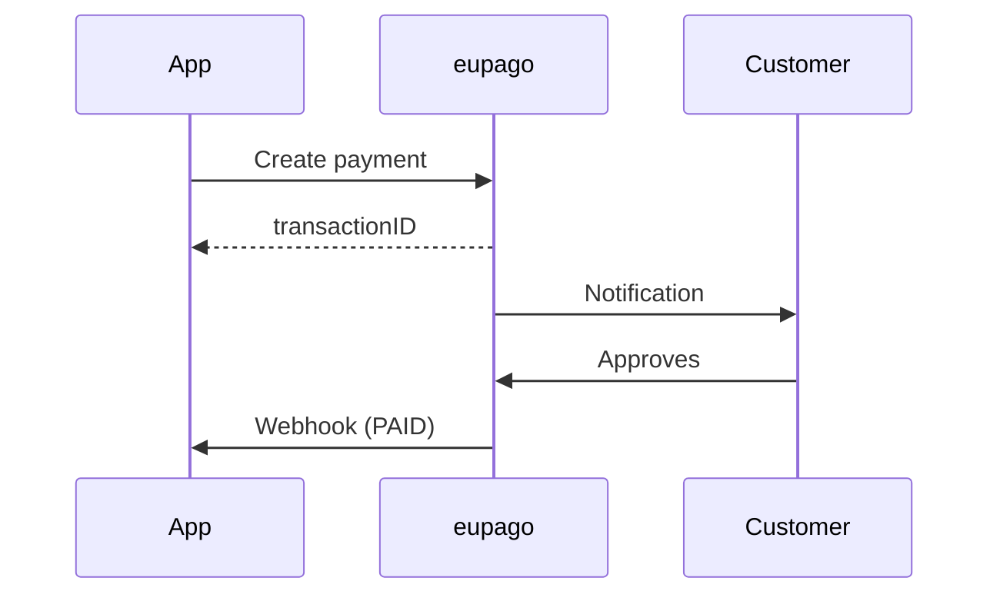
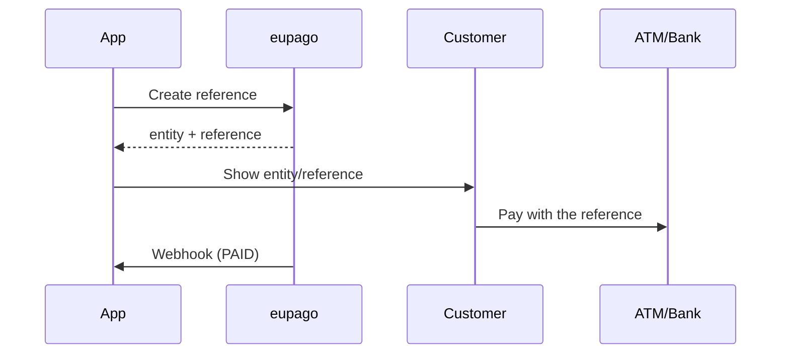
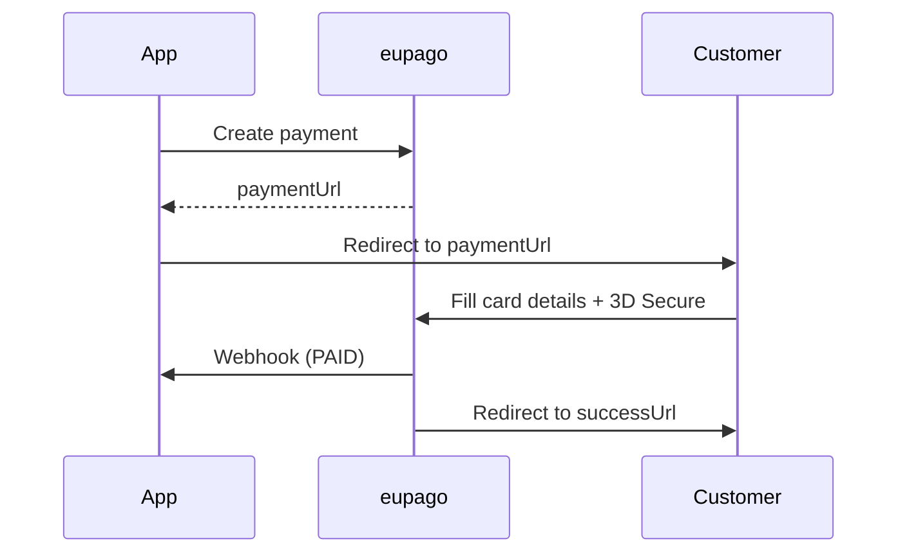

# Which method to choose?

## Decision guide

| I need to... | Method | Payment time | Max amount |
|---|---|---|---|
| Immediate mobile payment | [MB WAY](mbway.md) | 5 minutes | 99,999 EUR |
| ATM or online banking reference | [Multibanco](multibanco.md) | 1–30 days | 99,999 EUR |
| Pay with Visa/Mastercard | [Credit Card](credit-card.md) | Immediate | 3,999 EUR |
| Apple Wallet | [Apple Pay](apple-pay.md) | Immediate | 99,999 EUR |
| Google Wallet | [Google Pay](google-pay.md) | Immediate | 99,999 EUR |
| Automatic monthly charges | [CC Subscription](credit-card.md#subscriptions) | Recurring | 3,999 EUR |
| Reserve amount, charge later | [CC Auth + Capture](credit-card.md#auth--capture) | Flexible | 3,999 EUR |

## Compared flows

### Direct payment (MB WAY, Apple Pay, Google Pay)



### Reference (Multibanco)



### Redirect (Credit Card)



## All methods follow the same pattern

```python
from decimal import Decimal
from eupago import EupagoClient

client = EupagoClient(api_key="...", sandbox=True)

# The result is always PaymentResult
result = client.{method}.create_payment(
    order_id="ORD-001",
    amount=Decimal("49.90"),
    ...
)

print(result.status)          # PaymentStatus.PENDING
print(result.transaction_id)  # Transaction ID
print(result.raw_response)    # Raw eupago JSON
```
