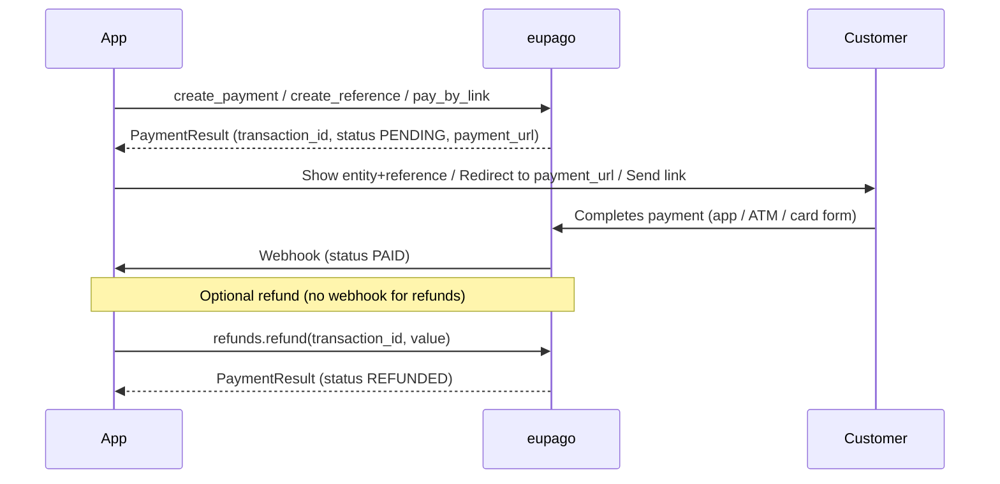

# Which method to choose?

## Decision guide

| I need to... | Method | When to use it |
|---|---|---|
| Immediate mobile payment | [MB WAY](mbway.md) | Customer has the MB WAY app. 5-min approval. |
| ATM or homebanking reference | [Multibanco](multibanco.md) | Customer pays at their own pace (1–30 days). |
| Card on a hosted page | [Credit Card](credit-card.md) | Web checkout with 3D-Secure. |
| Apple Wallet (iOS/Safari) | [Apple Pay](apple-pay.md) | Tokenised in-app/in-browser payment. |
| Google Pay (Android/Chrome) | [Google Pay](google-pay.md) | Tokenised in-app/in-browser payment. |
| Let the customer pick | [Pay By Link](pay-by-link.md) | Send one URL — invoicing, social, no checkout. |
| Refund a previous payment | [Refunds](refund.md) | Total or partial, requires OAuth credentials. |

Every payment method returns a `PaymentResult`. Common fields: `transaction_id`,
`status` (`PaymentStatus`), `amount` (`Decimal`), `payment_url` (when the
customer is redirected), `raw_response` (the unparsed eupago JSON).

## The full payment lifecycle

Every method shares the same shape: create → wait → webhook → (optionally)
refund. The differences are only in **how** the customer pays.



## Same call shape across methods

```python
from decimal import Decimal
from eupago import EupagoClient

client = EupagoClient(api_key="...", sandbox=True)

result = client.<method>.create_payment(
    order_id="ORD-001",
    amount=Decimal("49.90"),
    ...
)

print(result.status)          # PaymentStatus.PENDING
print(result.transaction_id)  # Transaction ID
print(result.payment_url)     # Hosted page URL (when applicable)
print(result.raw_response)    # Raw eupago JSON (always)
```

See the per-method pages for the exact parameters, and the
[examples folder](https://github.com/bilouro/eupago-python/tree/main/examples)
for runnable, end-to-end scripts.
