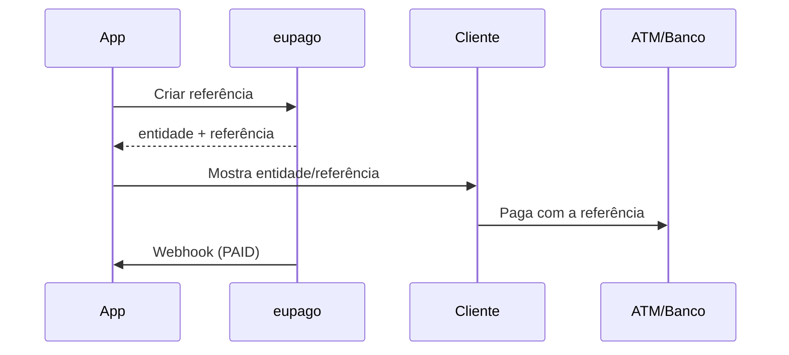
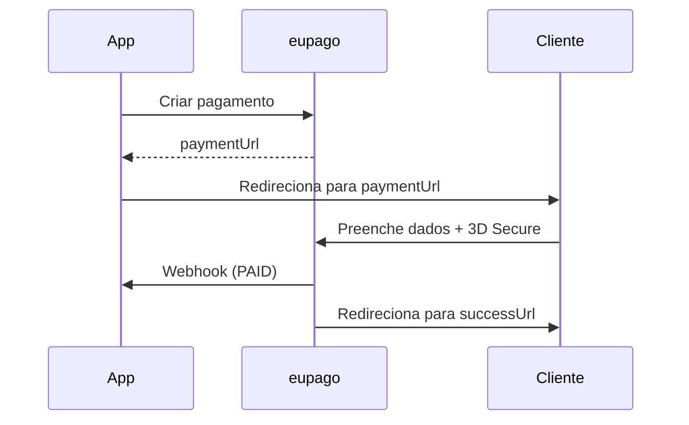

# Qual método escolher?

## Guia de decisão

| Preciso de... | Método | Tempo de pagamento | Valor máx. |
|---|---|---|---|
| Pagamento imediato via telemóvel | [MB WAY](mbway.md) | 5 minutos | 99.999 EUR |
| Referência para ATM ou homebanking | [Multibanco](multibanco.md) | 1–30 dias | 99.999 EUR |
| Pagar com Visa/Mastercard | [Cartão de Crédito](credit-card.md) | Imediato | 3.999 EUR |
| Apple Wallet | [Apple Pay](apple-pay.md) | Imediato | 99.999 EUR |
| Google Wallet | [Google Pay](google-pay.md) | Imediato | 99.999 EUR |
| Cobrar mensalidade automaticamente | [CC Subscription](credit-card.md#subscriptions) | Recorrente | 3.999 EUR |
| Reservar montante e cobrar depois | [CC Auth + Capture](credit-card.md#auth--capture) | Flexível | 3.999 EUR |

## Fluxos comparados

### Pagamento directo (MB WAY, Apple Pay, Google Pay)


### Referência (Multibanco)



### Redirect (Cartão de Crédito)



## Todos os métodos usam o mesmo padrão

```python
from decimal import Decimal
from eupago import EupagoClient

client = EupagoClient(api_key="...", sandbox=True)

# O resultado é sempre PaymentResult
result = client.{método}.create_payment(
    order_id="ORD-001",
    amount=Decimal("49.90"),
    ...
)

print(result.status)          # PaymentStatus.PENDING
print(result.transaction_id)  # ID da transação
print(result.raw_response)    # JSON original da eupago
```
