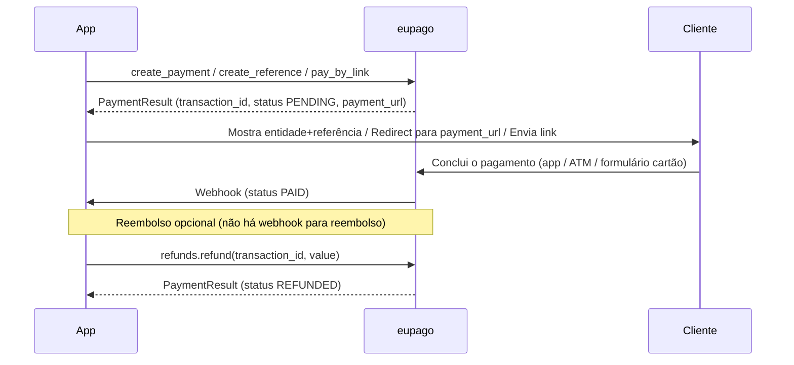

# Qual método escolher?

## Guia de decisão

| Preciso de... | Método | Quando usar |
|---|---|---|
| Pagamento imediato no telemóvel | [MB WAY](mbway.md) | Cliente tem a app MB WAY. Aprovação em 5 min. |
| Referência ATM/homebanking | [Multibanco](multibanco.md) | Cliente paga ao seu ritmo (1–30 dias). |
| Cartão em página alojada | [Credit Card](credit-card.md) | Checkout web com 3D-Secure. |
| Apple Wallet (iOS/Safari) | [Apple Pay](apple-pay.md) | Pagamento tokenizado no browser ou app. |
| Google Pay (Android/Chrome) | [Google Pay](google-pay.md) | Pagamento tokenizado no browser ou app. |
| Cliente escolhe como pagar | [Pay By Link](pay-by-link.md) | Envia um único URL — facturas, social, sem checkout. |
| Reembolsar um pagamento | [Refunds](refund.md) | Total ou parcial, requer credenciais OAuth. |

Todos os métodos devolvem um `PaymentResult`. Campos comuns: `transaction_id`,
`status` (`PaymentStatus`), `amount` (`Decimal`), `payment_url` (quando há
redirect), `raw_response` (o JSON cru do eupago).

## O ciclo completo

Todos os métodos seguem a mesma forma: criar → esperar → webhook → (opcional)
reembolsar. A única diferença é **como** o cliente paga.



## Mesma forma para todos os métodos

```python
from decimal import Decimal
from eupago import EupagoClient

client = EupagoClient(api_key="...", sandbox=True)

result = client.<metodo>.create_payment(
    order_id="ORD-001",
    amount=Decimal("49.90"),
    ...
)

print(result.status)          # PaymentStatus.PENDING
print(result.transaction_id)  # ID da transação
print(result.payment_url)     # URL da página alojada (quando aplicável)
print(result.raw_response)    # JSON cru do eupago (sempre)
```

Consulta as páginas individuais para os parâmetros exactos, e a
[pasta examples](https://github.com/bilouro/eupago-python/tree/main/examples)
para scripts runnable de ponta a ponta.
