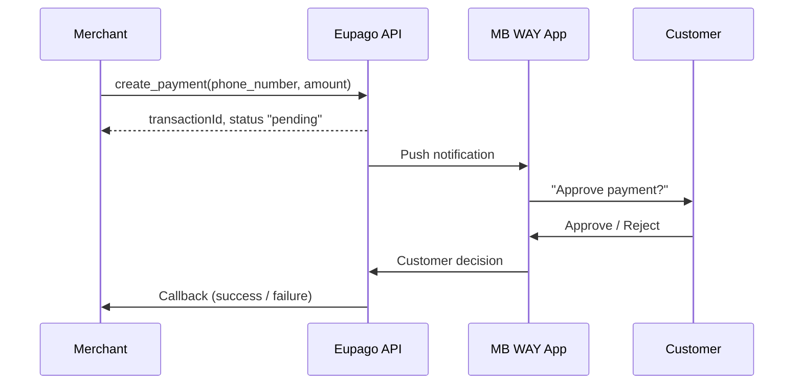
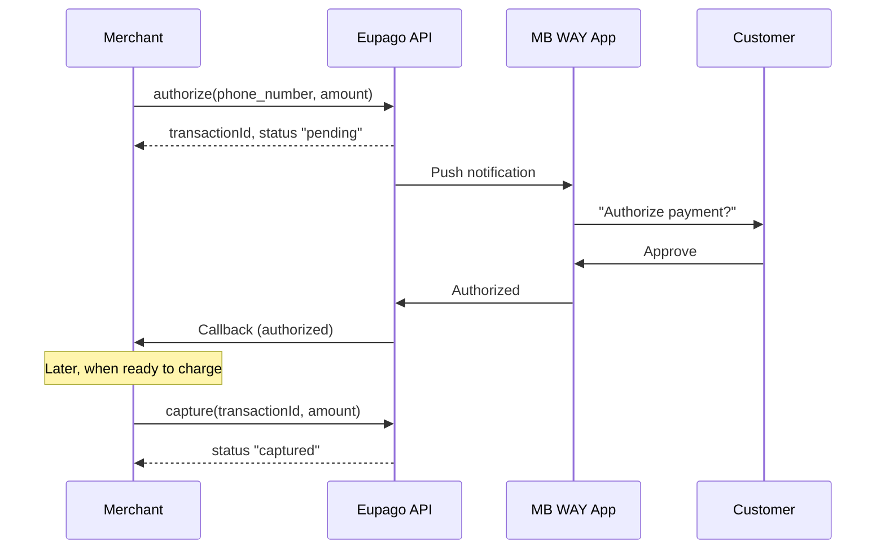

# MB WAY

## What it is

MB WAY is a mobile payment method widely used in Portugal. When a payment is created, the customer receives a push notification on the MB WAY app and has **5 minutes** to approve or reject the transaction. The merchant is notified of the result via callback.

MB WAY supports two flows:

- **Direct payment** -- a single call that debits the customer immediately upon approval.
- **Authorization + Capture** -- a two-step flow where the amount is reserved first and captured later, useful for marketplaces or delayed-fulfillment scenarios.

The maximum amount per transaction is **99,999 EUR**.

## Flow diagram

### Direct payment



### Authorization + Capture



## Full example

### Direct payment

```python
from decimal import Decimal
from eupago import EupagoClient

client = EupagoClient(api_key="your-api-key")

response = client.mbway.create_payment(
    phone_number="912345678",
    amount=Decimal("25.00"),
    currency="EUR",
    order_id="order-1001",
    callback_url="https://example.com/callback",
)

print(response.transaction_id)  # "eupago-xxxx-xxxx"
print(response.status)           # "pending"
```

### Authorization + Capture

```python
from decimal import Decimal
from eupago import EupagoClient

client = EupagoClient(api_key="your-api-key")

# Step 1: Authorize
auth = client.mbway.authorize(
    phone_number="912345678",
    amount=Decimal("150.00"),
    currency="EUR",
    order_id="order-2002",
    callback_url="https://example.com/callback",
)

print(auth.transaction_id)  # "eupago-xxxx-xxxx"
print(auth.status)           # "pending"

# Step 2: Capture (after customer approves and you are ready to charge)
capture = client.mbway.capture(
    transaction_id=auth.transaction_id,
    amount=Decimal("150.00"),
)

print(capture.status)  # "captured"
```

## Parameters

### `create_payment`

| Parameter      | Type      | Required | Description                                                        |
|----------------|-----------|----------|--------------------------------------------------------------------|
| `phone_number` | `str`     | Yes      | Customer phone in `"9XXXXXXXX"` (9 digits, PT MB WAY format) format (country code + number) |
| `amount`       | `Decimal` | Yes      | Amount to charge (max 99,999 EUR)                                  |
| `currency`     | `str`     | No       | ISO 4217 currency code. Default: `"EUR"`                           |
| `order_id`     | `str`     | No       | Your internal order identifier                                     |
| `callback_url` | `str`     | No       | URL to receive the payment result notification                     |

### `authorize`

| Parameter      | Type      | Required | Description                                                        |
|----------------|-----------|----------|--------------------------------------------------------------------|
| `phone_number` | `str`     | Yes      | Customer phone in `"9XXXXXXXX"` (9 digits, PT MB WAY format) format (country code + number) |
| `amount`       | `Decimal` | Yes      | Amount to authorize (max 99,999 EUR)                               |
| `currency`     | `str`     | No       | ISO 4217 currency code. Default: `"EUR"`                           |
| `order_id`     | `str`     | No       | Your internal order identifier                                     |
| `callback_url` | `str`     | No       | URL to receive the authorization result notification               |

### `capture`

| Parameter        | Type      | Required | Description                                            |
|------------------|-----------|----------|--------------------------------------------------------|
| `transaction_id` | `str`     | Yes      | Transaction ID returned by `authorize`                 |
| `amount`         | `Decimal` | Yes      | Amount to capture (must be <= authorized amount)       |

## Response

All MB WAY methods return a response object with the following fields:

| Field              | Type   | Description                                           |
|--------------------|--------|-------------------------------------------------------|
| `transaction_id`   | `str`  | Unique Eupago transaction identifier                  |
| `status`           | `str`  | Current status: `"pending"`, `"captured"`, `"failed"` |
| `message`          | `str`  | Human-readable status description                     |
| `method`           | `str`  | Always `"mbway"`                                      |

## Async variant

All methods are available as coroutines through `AsyncEupagoClient`:

```python
import asyncio
from decimal import Decimal
from eupago import AsyncEupagoClient

async def main():
    client = AsyncEupagoClient(api_key="your-api-key")

    response = await client.mbway.create_payment(
        phone_number="912345678",
        amount=Decimal("25.00"),
        order_id="order-1001",
        callback_url="https://example.com/callback",
    )
    print(response.status)

asyncio.run(main())
```

## Notes

- The phone number **must** follow the format `"9XXXXXXXX"` (9 digits, PT MB WAY format) -- the country code, a `#` separator, and the 9-digit phone number.
- The customer has **5 minutes** to approve or reject the payment on the MB WAY app. If no action is taken, the transaction expires automatically.
- MB WAY is only available for Portuguese phone numbers (country code `351`).
- The maximum transaction amount is **99,999 EUR**.
- When using authorization + capture, the captured amount can be less than or equal to the authorized amount, but never more.
- Always set up a `callback_url` to receive asynchronous payment notifications, since the customer may approve the payment after your initial request returns.
