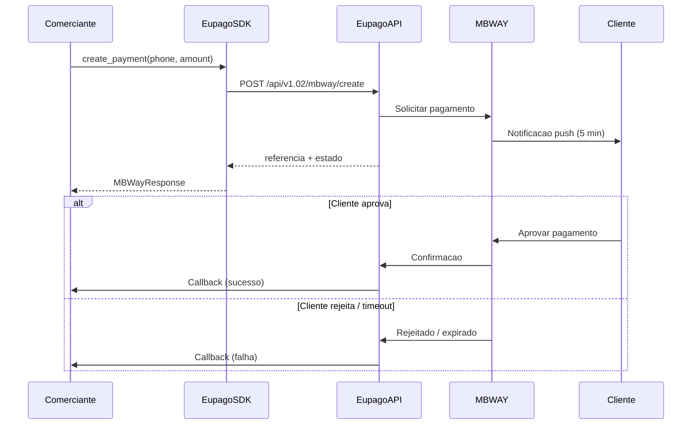

# MB WAY

## O que e

MB WAY e um metodo de pagamento movel amplamente utilizado em Portugal. O cliente recebe uma notificacao push no telemovel e tem **5 minutos** para aprovar o pagamento na aplicacao MB WAY. Apos a aprovacao, o pagamento e confirmado em tempo real.

- **Montante maximo:** 99.999 EUR
- **Tempo de aprovacao:** 5 minutos
- **Formato do telemovel:** `"912345678"` (indicativo do pais + numero)

## Diagrama de fluxo



## Exemplo completo

```python
from decimal import Decimal
from eupago import EupagoClient

client = EupagoClient(
    api_key="demo-api-key",
    sandbox=True,
)

# Criar pagamento MB WAY
response = client.mbway.create_payment(
    phone_number="912345678",
    amount=Decimal("25.50"),
    transaction_key="order-12345",
    callback_url="https://example.com/callback",
)

print(f"Referencia: {response.reference}")
print(f"Estado: {response.status}")
print(f"Transacao: {response.transaction_id}")

# Autorizar pagamento (pre-autorizacao)
auth_response = client.mbway.authorize(
    phone_number="912345678",
    amount=Decimal("50.00"),
    transaction_key="order-67890",
)

print(f"Auth ID: {auth_response.authorization_id}")

# Capturar pagamento pre-autorizado
capture_response = client.mbway.capture(
    authorization_id=auth_response.authorization_id,
    amount=Decimal("50.00"),
)

print(f"Captura: {capture_response.status}")
```

## Parametros

### `create_payment`

| Parametro         | Tipo      | Obrigatorio | Descricao                                                    |
| ----------------- | --------- | ----------- | ------------------------------------------------------------ |
| `phone_number`    | `str`     | Sim         | Numero do telemovel no formato `"912345678"`             |
| `amount`          | `Decimal` | Sim         | Montante a cobrar (max: 99.999 EUR)                          |
| `transaction_key` | `str`     | Sim         | Identificador unico da transacao no sistema do comerciante   |
| `callback_url`    | `str`     | Nao         | URL para receber notificacoes de estado do pagamento         |
| `description`     | `str`     | Nao         | Descricao do pagamento visivel para o cliente                |

### `authorize`

| Parametro         | Tipo      | Obrigatorio | Descricao                                                    |
| ----------------- | --------- | ----------- | ------------------------------------------------------------ |
| `phone_number`    | `str`     | Sim         | Numero do telemovel no formato `"912345678"`             |
| `amount`          | `Decimal` | Sim         | Montante a pre-autorizar (max: 99.999 EUR)                   |
| `transaction_key` | `str`     | Sim         | Identificador unico da transacao no sistema do comerciante   |

### `capture`

| Parametro          | Tipo      | Obrigatorio | Descricao                                                  |
| ------------------ | --------- | ----------- | ---------------------------------------------------------- |
| `authorization_id` | `str`     | Sim         | ID da autorizacao obtido no passo `authorize`              |
| `amount`           | `Decimal` | Sim         | Montante a capturar (pode ser inferior ao autorizado)      |

## Resposta

```python
# Resposta de create_payment
{
    "status": "ok",
    "reference": "MB12345678",
    "transaction_id": "txn_abc123",
    "method": "mbway",
    "amount": "25.50",
    "currency": "EUR",
}
```

| Campo            | Tipo  | Descricao                                              |
| ---------------- | ----- | ------------------------------------------------------ |
| `status`         | `str` | Estado do pedido: `"ok"` ou `"error"`                  |
| `reference`      | `str` | Referencia interna do pagamento                        |
| `transaction_id` | `str` | Identificador unico da transacao na euPago             |
| `method`         | `str` | Metodo de pagamento utilizado (`"mbway"`)              |
| `amount`         | `str` | Montante do pagamento                                  |
| `currency`       | `str` | Moeda (`"EUR"`)                                        |

## Variante async

```python
import asyncio
from decimal import Decimal
from eupago import AsyncEupagoClient

async def main():
    client = AsyncEupagoClient(
        api_key="demo-api-key",
        sandbox=True,
    )

    response = await client.mbway.create_payment(
        phone_number="912345678",
        amount=Decimal("25.50"),
        transaction_key="order-12345",
        callback_url="https://example.com/callback",
    )

    print(f"Referencia: {response.reference}")
    print(f"Estado: {response.status}")

    await client.close()

asyncio.run(main())
```

## Notas

1. **Formato do numero de telefone:** O numero deve incluir o indicativo do pais separado por `#`. Para Portugal, usar `"9XXXXXXXX"` (9 digits, PT MB WAY format). Outros indicativos sao suportados para clientes MB WAY internacionais.

2. **Tempo limite de 5 minutos:** O cliente tem exatamente 5 minutos para aprovar o pagamento na aplicacao MB WAY. Apos esse periodo, o pagamento expira automaticamente e o callback recebe o estado de falha.

3. **Callbacks:** E altamente recomendado configurar um `callback_url` para receber notificacoes em tempo real sobre o estado do pagamento. Nao dependa apenas de polling.

4. **Pre-autorizacao vs. pagamento direto:** Use `authorize` + `capture` quando precisar de validar o pagamento antes de o confirmar (por exemplo, reservas). Use `create_payment` para cobrar imediatamente.

5. **Montante maximo:** O montante maximo por transacao e de 99.999 EUR. Transacoes acima deste valor serao rejeitadas pela API.

6. **Ambiente sandbox:** Em sandbox, os pagamentos nao sao processados realmente. Use `sandbox=True` durante o desenvolvimento e testes.
