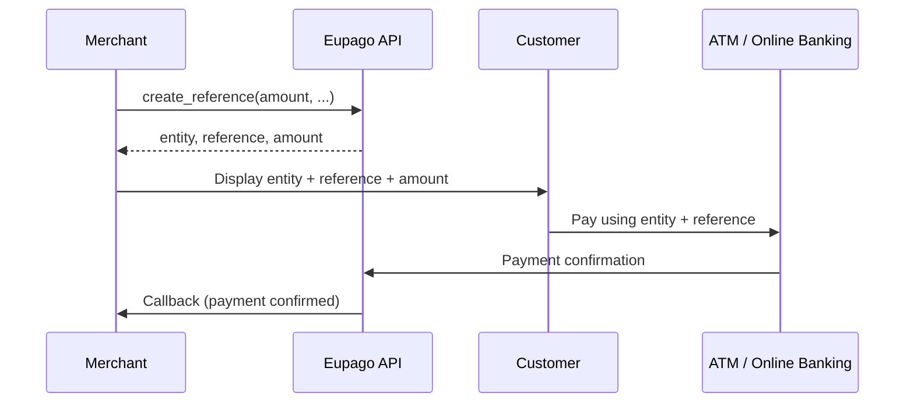

# Multibanco

## What it is

Multibanco is Portugal's national ATM and online banking network. When a payment reference is generated, the customer receives an **entity number** and a **reference number** that they can use to pay at any ATM, through online banking, or via a banking app. This is an offline payment method -- the customer pays at their own convenience within the configured time window.

Multibanco supports configurable expiration dates, minimum/maximum amounts, duplicate reference control, and expiry reminders.

The maximum amount per reference is **99,999 EUR**.

## Flow diagram



## Full example

### Create a reference

```python
from decimal import Decimal
from eupago import EupagoClient

client = EupagoClient(api_key="your-api-key")

response = client.multibanco.create_reference(
    amount=Decimal("49.99"),
    currency="EUR",
    order_id="order-3001",
    callback_url="https://example.com/callback",
    expires_at="2026-06-15T23:59:59Z",
    starts_at="2026-06-01T00:00:00Z",
    allow_duplicate=False,
    min_amount=Decimal("10.00"),
    max_amount=Decimal("100.00"),
    send_expiry_reminder=True,
)

print(response.entity)     # "11687"
print(response.reference)  # "123 456 789"
print(response.amount)     # Decimal("49.99")
```

### Get reference info

```python
from eupago import EupagoClient

client = EupagoClient(api_key="your-api-key")

info = client.multibanco.get_info(reference="123456789")

print(info.status)      # "pending" | "paid" | "expired"
print(info.amount)      # Decimal("49.99")
print(info.entity)      # "11687"
print(info.paid_at)     # datetime or None
```

## Parameters

### `create_reference`

| Parameter             | Type      | Required | Description                                                                 |
|-----------------------|-----------|----------|-----------------------------------------------------------------------------|
| `amount`              | `Decimal` | Yes      | Amount for the reference (max 99,999 EUR)                                   |
| `currency`            | `str`     | No       | ISO 4217 currency code. Default: `"EUR"`                                    |
| `order_id`            | `str`     | No       | Your internal order identifier                                              |
| `callback_url`        | `str`     | No       | URL to receive the payment confirmation notification                        |
| `expires_at`          | `str`     | No       | ISO 8601 datetime after which the reference can no longer be paid           |
| `starts_at`           | `str`     | No       | ISO 8601 datetime before which the reference cannot be paid                 |
| `allow_duplicate`     | `bool`    | No       | Whether to allow multiple payments on the same reference. Default: `False`  |
| `min_amount`          | `Decimal` | No       | Minimum amount accepted for payment (for open-amount references)            |
| `max_amount`          | `Decimal` | No       | Maximum amount accepted for payment (for open-amount references)            |
| `send_expiry_reminder`| `bool`    | No       | Send a reminder notification before the reference expires. Default: `False` |

### `get_info`

| Parameter   | Type  | Required | Description                           |
|-------------|-------|----------|---------------------------------------|
| `reference` | `str` | Yes      | The Multibanco reference to look up   |

## Response

### `create_reference` response

| Field            | Type      | Description                                    |
|------------------|-----------|------------------------------------------------|
| `entity`         | `str`     | Multibanco entity number (5 digits)            |
| `reference`      | `str`     | Multibanco reference number (9 digits)         |
| `amount`         | `Decimal` | Amount of the reference                        |
| `status`         | `str`     | Reference status: `"pending"`                  |
| `transaction_id` | `str`     | Unique Eupago transaction identifier           |
| `method`         | `str`     | Always `"multibanco"`                          |
| `message`        | `str`     | Human-readable status description              |

### `get_info` response

| Field       | Type              | Description                                              |
|-------------|-------------------|----------------------------------------------------------|
| `entity`    | `str`             | Multibanco entity number                                 |
| `reference` | `str`             | Multibanco reference number                              |
| `amount`    | `Decimal`         | Amount of the reference                                  |
| `status`    | `str`             | Reference status: `"pending"`, `"paid"`, or `"expired"`  |
| `paid_at`   | `datetime | None` | Datetime when payment was received, or `None`            |
| `method`    | `str`             | Always `"multibanco"`                                    |

## Async variant

All methods are available as coroutines through `AsyncEupagoClient`:

```python
import asyncio
from decimal import Decimal
from eupago import AsyncEupagoClient

async def main():
    client = AsyncEupagoClient(api_key="your-api-key")

    response = await client.multibanco.create_reference(
        amount=Decimal("49.99"),
        order_id="order-3001",
        callback_url="https://example.com/callback",
        expires_at="2026-06-15T23:59:59Z",
    )

    print(response.entity)
    print(response.reference)

asyncio.run(main())
```

## Notes

- Multibanco references are typically valid for a limited period. Always set `expires_at` to avoid stale unpaid references accumulating.
- The `starts_at` parameter is useful for pre-generating references that should only become payable on a future date (e.g., subscription renewals).
- When `allow_duplicate` is `False` (the default), a reference can only be paid once. Set it to `True` for recurring payments on the same reference.
- The `min_amount` and `max_amount` parameters create an open-amount reference, allowing the customer to pay any amount within the specified range. This is useful for donations or partial payments.
- The `send_expiry_reminder` flag triggers an automatic notification to the customer before the reference expires, which can help reduce abandoned payments.
- The entity number is assigned by Eupago and is shared across your account. The reference number is unique per transaction.
- Customers can pay at any Multibanco ATM, through any Portuguese bank's online banking portal, or via their banking app.
- The maximum amount per reference is **99,999 EUR**.
