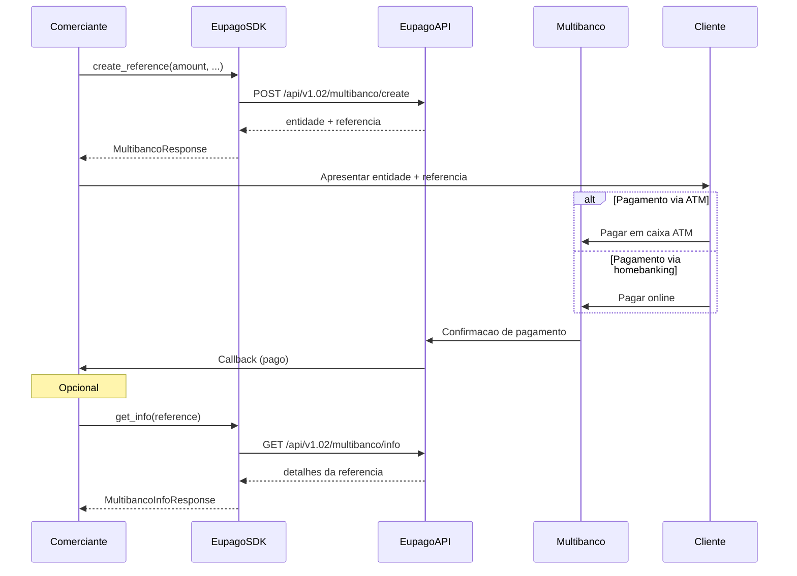

# Multibanco

## O que e

Multibanco e o sistema de pagamentos interbancario portugues. Este metodo gera uma **entidade** e **referencia** que o cliente pode usar para pagar em caixas ATM ou atraves de homebanking. A referencia e valida ate a data de expiracao configurada.

- **Montante maximo:** 99.999 EUR
- **Validade:** Configuravel via `expires_at`
- **Tipo:** Pagamento offline (ATM) ou online (homebanking)

## Diagrama de fluxo



## Exemplo completo

```python
from decimal import Decimal
from datetime import datetime, timedelta
from eupago import EupagoClient

client = EupagoClient(
    api_key="demo-api-key",
    sandbox=True,
)

# Criar referencia Multibanco
response = client.multibanco.create_reference(
    amount=Decimal("150.00"),
    transaction_key="order-12345",
    starts_at=datetime.now(),
    expires_at=datetime.now() + timedelta(days=7),
    allow_duplicate=False,
    min_amount=Decimal("100.00"),
    max_amount=Decimal("200.00"),
    send_expiry_reminder=True,
    callback_url="https://example.com/callback",
)

print(f"Entidade: {response.entity}")
print(f"Referencia: {response.reference}")
print(f"Montante: {response.amount} EUR")
print(f"Estado: {response.status}")

# Consultar informacao de uma referencia
info = client.multibanco.get_info(
    reference=response.reference,
    entity=response.entity,
)

print(f"Estado do pagamento: {info.payment_status}")
print(f"Data de criacao: {info.created_at}")
print(f"Data de expiracao: {info.expires_at}")
```

## Parametros

### `create_reference`

| Parametro             | Tipo       | Obrigatorio | Descricao                                                            |
| --------------------- | ---------- | ----------- | -------------------------------------------------------------------- |
| `amount`              | `Decimal`  | Sim         | Montante a cobrar (max: 99.999 EUR)                                  |
| `transaction_key`     | `str`      | Sim         | Identificador unico da transacao no sistema do comerciante           |
| `starts_at`           | `datetime` | Nao         | Data a partir da qual a referencia fica ativa                        |
| `expires_at`          | `datetime` | Nao         | Data de expiracao da referencia                                      |
| `allow_duplicate`     | `bool`     | Nao         | Permitir pagamentos duplicados com a mesma referencia                |
| `min_amount`          | `Decimal`  | Nao         | Montante minimo aceite para pagamento                                |
| `max_amount`          | `Decimal`  | Nao         | Montante maximo aceite para pagamento                                |
| `send_expiry_reminder`| `bool`     | Nao         | Enviar lembrete antes da referencia expirar                          |
| `callback_url`        | `str`      | Nao         | URL para receber notificacoes de estado do pagamento                 |
| `description`         | `str`      | Nao         | Descricao do pagamento                                               |

### `get_info`

| Parametro   | Tipo  | Obrigatorio | Descricao                                      |
| ----------- | ----- | ----------- | ---------------------------------------------- |
| `reference` | `str` | Sim         | Referencia Multibanco gerada                   |
| `entity`    | `str` | Sim         | Entidade Multibanco associada                  |

## Resposta

### Resposta de `create_reference`

```python
{
    "status": "ok",
    "entity": "10611",
    "reference": "123 456 789",
    "amount": "150.00",
    "currency": "EUR",
    "starts_at": "2026-05-27T00:00:00Z",
    "expires_at": "2026-06-03T00:00:00Z",
    "allow_duplicate": False,
    "min_amount": "100.00",
    "max_amount": "200.00",
}
```

| Campo             | Tipo   | Descricao                                              |
| ----------------- | ------ | ------------------------------------------------------ |
| `status`          | `str`  | Estado do pedido: `"ok"` ou `"error"`                  |
| `entity`          | `str`  | Entidade Multibanco (5 digitos)                        |
| `reference`       | `str`  | Referencia de pagamento (9 digitos, formatada)         |
| `amount`          | `str`  | Montante do pagamento                                  |
| `currency`        | `str`  | Moeda (`"EUR"`)                                        |
| `starts_at`       | `str`  | Data de inicio de validade                             |
| `expires_at`      | `str`  | Data de expiracao                                      |
| `allow_duplicate` | `bool` | Se pagamentos duplicados sao permitidos                |
| `min_amount`      | `str`  | Montante minimo aceite                                 |
| `max_amount`      | `str`  | Montante maximo aceite                                 |

### Resposta de `get_info`

```python
{
    "status": "ok",
    "payment_status": "pending",
    "entity": "10611",
    "reference": "123 456 789",
    "amount": "150.00",
    "created_at": "2026-05-27T00:00:00Z",
    "expires_at": "2026-06-03T00:00:00Z",
    "paid_at": None,
}
```

## Variante async

```python
import asyncio
from decimal import Decimal
from datetime import datetime, timedelta
from eupago import AsyncEupagoClient

async def main():
    client = AsyncEupagoClient(
        api_key="demo-api-key",
        sandbox=True,
    )

    # Criar referencia Multibanco
    response = await client.multibanco.create_reference(
        amount=Decimal("150.00"),
        transaction_key="order-12345",
        expires_at=datetime.now() + timedelta(days=7),
        send_expiry_reminder=True,
        callback_url="https://example.com/callback",
    )

    print(f"Entidade: {response.entity}")
    print(f"Referencia: {response.reference}")

    # Consultar informacao
    info = await client.multibanco.get_info(
        reference=response.reference,
        entity=response.entity,
    )

    print(f"Estado: {info.payment_status}")

    await client.close()

asyncio.run(main())
```

## Notas

1. **Entidade e referencia:** O cliente precisa de ambos para efetuar o pagamento. Apresente-os de forma clara na interface. A referencia e tipicamente formatada em grupos de 3 digitos (ex: `123 456 789`).

2. **Validade da referencia:** Use `starts_at` e `expires_at` para controlar o periodo de validade. Sem `expires_at`, a referencia pode permanecer ativa indefinidamente (dependendo da configuracao da conta).

3. **Pagamentos duplicados:** Por defeito, uma referencia aceita apenas um pagamento. Defina `allow_duplicate=True` se pretender aceitar multiplos pagamentos com a mesma referencia (util para donativos ou pagamentos recorrentes).

4. **Montantes flexiveis:** Use `min_amount` e `max_amount` para permitir que o cliente pague um valor dentro de um intervalo. Isto e util quando o montante exato pode variar (ex: gorjetas, donativos).

5. **Lembrete de expiracao:** Ative `send_expiry_reminder=True` para que a euPago envie um lembrete ao cliente antes da referencia expirar. Requer que o email do cliente esteja configurado.

6. **Tempo de processamento:** Pagamentos Multibanco podem demorar ate 24-48 horas a serem confirmados pelo sistema bancario, embora normalmente sejam processados em poucas horas.

7. **Montante maximo:** O montante maximo por transacao e de 99.999 EUR. Para montantes superiores, sera necessario dividir em multiplas referencias.
