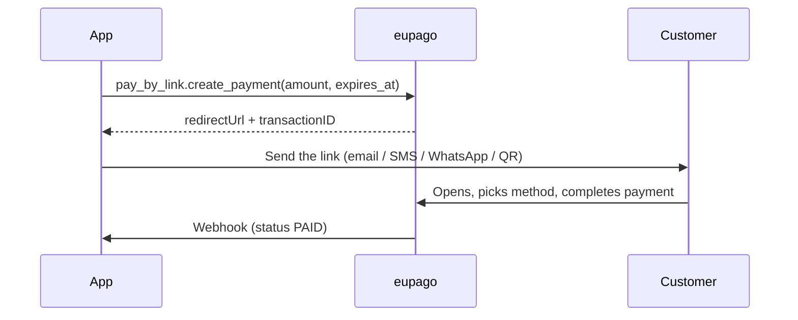

# Pay By Link

## What it is

A single hosted URL the customer opens to choose how to pay: **MB WAY,
Multibanco, Card, Apple/Google Pay, Cofidis, …** No checkout or website is
needed on your side. Ideal for invoices, social-commerce flows
(Instagram/WhatsApp DMs), B2B billing, donations, or any time you want the
customer — not you — to pick the method.

The final outcome arrives via the standard webhook when the customer
completes the flow on eupago's page.

## Flow



## Basic example

```python
from datetime import datetime, timedelta
from decimal import Decimal
from eupago import EupagoClient
from eupago.models import Customer

client = EupagoClient(api_key="...", sandbox=True)

link = client.pay_by_link.create_payment(
    order_id="INV-2026-001",
    amount=Decimal("199.00"),
    customer=Customer(
        name="Joana Silva",
        email="joana@example.com",
        notify=True,  # eupago will email the link to the customer
    ),
    expires_at=datetime.now() + timedelta(days=7),
)

print(link.payment_url)     # https://sandbox.eupago.pt/api/extern/paybylink/form/...
print(link.transaction_id)  # af3df607c6724870be962a69cac30b99
```

## Full example (products + shipping + redirects)

```python
cart = client.pay_by_link.create_payment(
    order_id="ORD-2026-099",
    amount=Decimal("125.00"),
    shipping=Decimal("5.50"),
    success_url="https://shop.example.com/thank-you",
    error_url="https://shop.example.com/failed",
    back_url="https://shop.example.com/cart",
    expires_at=datetime.now() + timedelta(hours=24),
    products=[
        {"sku": "BOOK-1", "name": "Pilates Guide", "value": 60.00, "quantity": 2},
        {"sku": "MAT-1",  "name": "Yoga Mat",     "value":  5.00, "quantity": 1},
    ],
    customer=Customer(name="Final Customer", email="customer@example.com"),
)
```

## Parameters

### `create_payment`

| Parameter      | Type                  | Required | Description |
|----------------|-----------------------|----------|-------------|
| `order_id`     | `str`                 | Yes      | Your internal identifier |
| `amount`       | `Decimal`             | Yes      | Total amount (max 99,999 EUR) |
| `currency`     | `str`                 | No       | ISO 4217. Default `"EUR"` |
| `customer`     | `Customer`            | No       | When `notify=True` eupago emails the link |
| `success_url`  | `str`                 | No       | Redirect target after success |
| `error_url`    | `str`                 | No       | Redirect target after failure |
| `back_url`     | `str`                 | No       | Where the "Back" button leads |
| `expires_at`   | `datetime`            | No       | Link expiry |
| `shipping`     | `Decimal`             | No       | Shipping cost shown separately |
| `language`     | `str`                 | No       | Page language. Default `"PT"` |
| `products`     | `list[dict[str, Any]]`| No       | Line items (sku, name, value, quantity, tax, discount) |

## Refund

Refunds use the management API — see [Refunds](refund.md):

```python
client.refunds.refund(
    transaction_id=link.transaction_id,
    value=Decimal("199.00"),
    reason="Customer cancelled",
)
```

## Async

```python
link = await client.pay_by_link.create_payment_async(
    order_id="INV-2026-002",
    amount=Decimal("49.90"),
)
```
