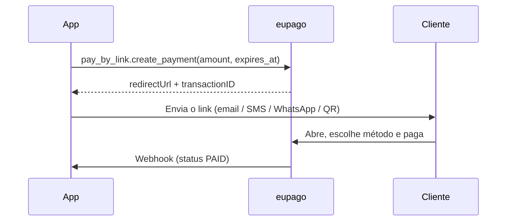

# Pay By Link

## O que é

Um único URL alojado que o cliente abre para escolher como pagar: **MB WAY,
Multibanco, Cartão, Apple/Google Pay, Cofidis, …** Não precisas de site nem
checkout próprios. Ideal para facturas, vendas via Instagram/WhatsApp,
facturação B2B, donativos ou sempre que o cliente — e não tu — escolhe o
método.

O resultado final chega pelo webhook normal assim que o cliente concluir o
pagamento na página da eupago.

## Fluxo



## Exemplo simples

```python
from datetime import datetime, timedelta
from decimal import Decimal
from eupago import EupagoClient
from eupago.models import Customer

client = EupagoClient(api_key="...", sandbox=True)

link = client.pay_by_link.create_payment(
    order_id="FAT-2026-001",
    amount=Decimal("199.00"),
    customer=Customer(
        name="Joana Silva",
        email="joana@exemplo.pt",
        notify=True,  # eupago envia o link por email ao cliente
    ),
    expires_at=datetime.now() + timedelta(days=7),
)

print(link.payment_url)     # https://sandbox.eupago.pt/api/extern/paybylink/form/...
print(link.transaction_id)  # af3df607c6724870be962a69cac30b99
```

## Exemplo completo (produtos + portes + redirects)

```python
carrinho = client.pay_by_link.create_payment(
    order_id="ORD-2026-099",
    amount=Decimal("125.00"),
    shipping=Decimal("5.50"),
    success_url="https://loja.exemplo.pt/obrigado",
    error_url="https://loja.exemplo.pt/falha",
    back_url="https://loja.exemplo.pt/carrinho",
    expires_at=datetime.now() + timedelta(hours=24),
    products=[
        {"sku": "BOOK-1", "name": "Guia de Pilates", "value": 60.00, "quantity": 2},
        {"sku": "MAT-1",  "name": "Mat antiderrapante", "value": 5.00, "quantity": 1},
    ],
    customer=Customer(name="Cliente Final", email="cliente@exemplo.pt"),
)
```

## Parâmetros

### `create_payment`

| Parâmetro      | Tipo                  | Obrigatório | Descrição |
|----------------|-----------------------|-------------|-----------|
| `order_id`     | `str`                 | Sim         | O teu identificador interno |
| `amount`       | `Decimal`             | Sim         | Valor total (máx 99 999 EUR) |
| `currency`     | `str`                 | Não         | ISO 4217. Default `"EUR"` |
| `customer`     | `Customer`            | Não         | Com `notify=True` o eupago envia o link por email |
| `success_url`  | `str`                 | Não         | Redirect após sucesso |
| `error_url`    | `str`                 | Não         | Redirect após falha |
| `back_url`     | `str`                 | Não         | Destino do botão "Voltar" |
| `expires_at`   | `datetime`            | Não         | Expiração do link |
| `shipping`     | `Decimal`             | Não         | Portes apresentados em separado |
| `language`     | `str`                 | Não         | Idioma da página. Default `"PT"` |
| `products`     | `list[dict[str, Any]]`| Não         | Linhas de produto (sku, name, value, quantity, tax, discount) |

## Reembolso

Os reembolsos usam a API de management — ver [Refunds](refund.md):

```python
client.refunds.refund(
    transaction_id=link.transaction_id,
    value=Decimal("199.00"),
    reason="Cliente cancelou",
)
```

## Async

```python
link = await client.pay_by_link.create_payment_async(
    order_id="FAT-2026-002",
    amount=Decimal("49.90"),
)
```
