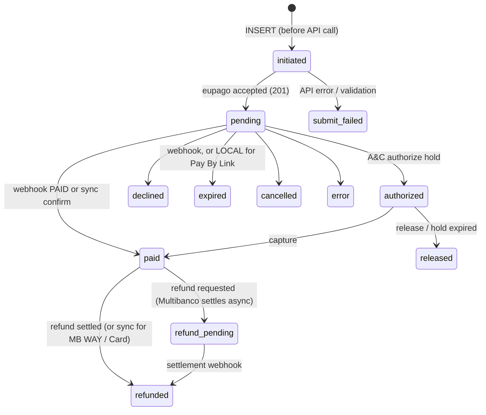
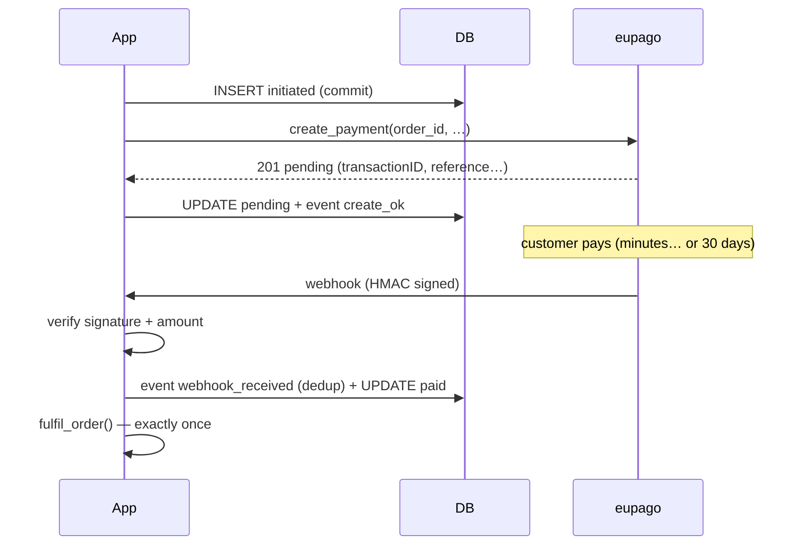
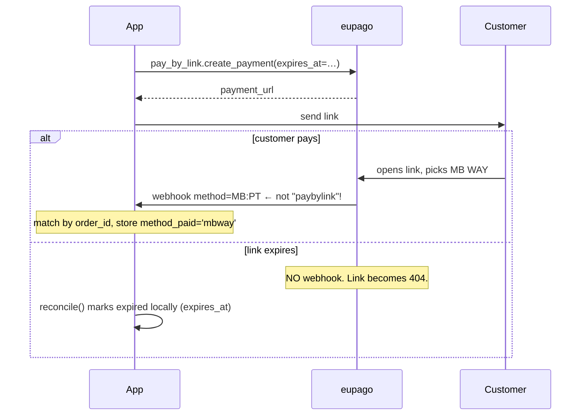
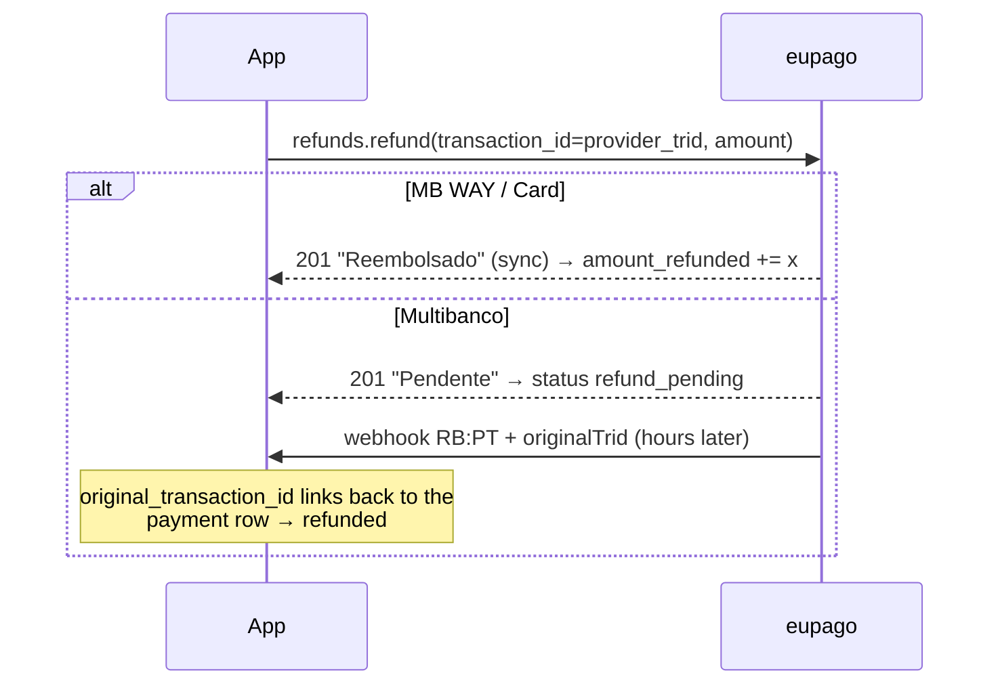

# Persisting payments

How to store eupago payments in your database so that nothing is lost when
a process crashes, a webhook arrives twice (or before you expect it), or a
customer pays a Pay By Link with a method you didn't predict.

This recipe gives you a **reference schema** (PostgreSQL, with a
[DynamoDB mapping](#dynamodb-mapping) at the end), the **state machine**,
and the **four functions** that drive it. It is framework-agnostic — pair
it with the [FastAPI](fastapi.md), [Django](django.md) or [Flask](flask.md)
recipe for the HTTP layer.

## The one rule: write before you call

Insert the payment row **before** calling eupago, in the same process,
committed:

```
INSERT (status='initiated')  →  eupago API call  →  UPDATE (status='pending')
```

If everything falls apart between the INSERT and the response — process
killed, network gone, deploy mid-request — you are left with an
`initiated` row. That orphan is *visible*: a reconciliation job can find
it and decide (query eupago, or mark it abandoned). Without write-ahead,
a crash leaves you with a payment eupago knows about and you don't —
invisible until an angry customer calls.

Write-ahead has a second, less obvious benefit: **the row always exists
before eupago does**, so a webhook can never arrive before there is
something to attach it to. One whole class of race condition is gone by
construction.

## The state machine



`initiated` and `submit_failed` are **local-only** states — eupago never
sees them. Everything else maps to the SDK's `PaymentStatus` enum, which
already normalizes eupago's raw codes (`"Paga"`, `"Canceled"`,
`"REFUNDED"`, …) for you.

Confirmation converges to the same place whether it is **synchronous**
(the API response already says paid — e.g. MB WAY / Card refunds return
`"Reembolsado"` immediately) or **asynchronous** (the webhook arrives
minutes or days later — Multibanco can take up to 30 days). Your handler
code shouldn't care which path delivered the truth.

## Schema (PostgreSQL)

Three tables: current state, append-only history, and subscriptions.

```sql
CREATE TABLE payments (
    id                  BIGINT GENERATED ALWAYS AS IDENTITY PRIMARY KEY,

    -- THE correlation key. You generate it, eupago echoes it back in
    -- every response and webhook ("identifier"). Always match on this.
    order_id            TEXT NOT NULL UNIQUE,

    -- What you asked for vs what the webhook said was actually used.
    -- They differ for Pay By Link: you request 'pay_by_link', the
    -- customer picks MB WAY, the webhook reports 'mbway'.
    method_requested    TEXT NOT NULL,
    method_paid         TEXT,

    -- Money is NUMERIC, never float. amount_refunded accumulates:
    -- partial refunds add up, they don't flip a boolean.
    amount              NUMERIC(12,2) NOT NULL,
    currency            CHAR(3) NOT NULL DEFAULT 'EUR',
    amount_refunded     NUMERIC(12,2) NOT NULL DEFAULT 0,

    -- Normalized lifecycle state (CHECK, not native ENUM — adding a
    -- state later is an ALTER, not a type migration).
    status              TEXT NOT NULL DEFAULT 'initiated'
        CHECK (status IN ('initiated', 'submit_failed', 'pending',
                          'authorized', 'released', 'paid', 'declined',
                          'expired', 'cancelled', 'error',
                          'refund_pending', 'refunded')),
    -- What eupago literally said, for debugging ("Paga", "REFUNDED", …)
    raw_status          TEXT,

    -- eupago gives you TWO different ids for the same transaction:
    --   provider_payment_id: "transactionID" from the create response
    --     (a hex string for Card / Apple Pay / Google Pay hosted flows)
    --   provider_trid: "trid" from the webhook (numeric) — this is the
    --     one the refund endpoint wants.
    -- Store both. Verified live: a Google Pay create returned
    -- 019ebcbb…  while its webhook carried trid 29748670.
    provider_payment_id TEXT,
    provider_trid       TEXT,

    -- Multibanco
    reference           TEXT,
    entity              TEXT,

    -- Hosted flows (Pay By Link, Card form, wallet sheets)
    payment_url         TEXT,
    -- Pay By Link expiry is SILENT: no webhook fires, the link just
    -- becomes a 404. You own this deadline — see reconcile().
    expires_at          TIMESTAMPTZ,

    -- Set for recurring charges made against a subscription
    subscription_id     BIGINT REFERENCES subscriptions (id),

    initiated_at        TIMESTAMPTZ NOT NULL DEFAULT now(),
    submitted_at        TIMESTAMPTZ,
    confirmed_at        TIMESTAMPTZ,
    updated_at          TIMESTAMPTZ NOT NULL DEFAULT now()
);

CREATE INDEX payments_status_idx ON payments (status);
CREATE INDEX payments_trid_idx   ON payments (provider_trid);
```

Note what is **not** here: no card data (the hosted forms mean PAN never
touches your server — keep it that way), and no customer PII. If you need
to link a payment to a person, add a `customer_id` foreign key into your
own users table instead of copying phone/email around.

```sql
CREATE TABLE payment_events (
    id            BIGINT GENERATED ALWAYS AS IDENTITY PRIMARY KEY,
    payment_id    BIGINT NOT NULL REFERENCES payments (id),

    type          TEXT NOT NULL
        CHECK (type IN ('initiated', 'create_requested', 'create_ok',
                        'create_failed', 'webhook_received',
                        'webhook_rejected', 'status_changed',
                        'refund_requested', 'refund_ok', 'refund_failed',
                        'expired_locally', 'reconciled')),
    -- Where the truth came from
    source        TEXT NOT NULL
        CHECK (source IN ('api', 'webhook', 'reconciliation',
                          'backoffice', 'local')),

    -- The raw payload — ALWAYS stored already redacted (see snippet).
    -- This is your audit trail and your debugging lifeline.
    raw           JSONB,
    -- Webhook redelivery becomes a no-op instead of a duplicate.
    dedup_hash    TEXT UNIQUE,
    -- Did the HMAC check out? Rejected payloads are stored too (type
    -- 'webhook_rejected') but NEVER drive a status change.
    signature_verified BOOLEAN,

    -- GDPR retention: a purge job deletes raw payloads past this date.
    -- The financial state in `payments` lives forever; the raw PII-ish
    -- payloads don't have to.
    purge_after   TIMESTAMPTZ,

    created_at    TIMESTAMPTZ NOT NULL DEFAULT now()
);

CREATE INDEX payment_events_payment_idx ON payment_events (payment_id);
```

```sql
CREATE TABLE subscriptions (
    id                       BIGINT GENERATED ALWAYS AS IDENTITY PRIMARY KEY,

    -- eupago gives subscriptions TWO identifiers. Mixing them up is the
    -- #1 subscription integration bug:
    --   eupago_token: hex string returned by create_subscription —
    --     charge_subscription() takes THIS one.
    --   provider_subscription_id: the integer id (visible in the
    --     backoffice URL) — get/edit/revoke take THIS one.
    eupago_token             TEXT UNIQUE,
    provider_subscription_id INTEGER UNIQUE,

    status                   TEXT NOT NULL DEFAULT 'pending'
        CHECK (status IN ('pending', 'active', 'revoked', 'error')),
    created_at               TIMESTAMPTZ NOT NULL DEFAULT now(),
    updated_at               TIMESTAMPTZ NOT NULL DEFAULT now()
);
```

### Lock the history down

`payment_events` is append-only. Enforce that with grants, not
discipline — the application role simply cannot rewrite history:

```sql
GRANT SELECT, INSERT ON payment_events TO app_role;
-- no UPDATE, no DELETE
GRANT SELECT, INSERT, UPDATE ON payments TO app_role;
-- no DELETE on payments either: cancelled payments are a status, not
-- a missing row
```

(The retention purge job runs under a separate maintenance role that may
`UPDATE payment_events SET raw = NULL` past `purge_after`.)

## The four functions

The whole lifecycle is driven by four small functions. Shown with plain
SQL placeholders — adapt to your driver/ORM.

### 1. `begin_payment()` — write-ahead

```python
import uuid
from decimal import Decimal

def begin_payment(db, method: str, amount: Decimal) -> str:
    # Non-guessable on purpose: order_id travels in URLs and webhooks.
    # Sequential ids leak your sales volume and invite enumeration.
    order_id = f"ORD-{uuid.uuid4().hex[:16]}"

    db.execute(
        """INSERT INTO payments (order_id, method_requested, amount)
           VALUES (%s, %s, %s)""",
        (order_id, method, amount),
    )
    db.execute(
        """INSERT INTO payment_events (payment_id, type, source)
           SELECT id, 'initiated', 'local' FROM payments
           WHERE order_id = %s""",
        (order_id,),
    )
    db.commit()          # ← committed BEFORE eupago hears about it
    return order_id
```

### 2. `on_create_response()` — record what eupago said

```python
from eupago import EupagoClient, ValidationError, ApiError
from eupago.utils import redact_pii

def create_mbway_payment(db, client: EupagoClient, amount, phone):
    order_id = begin_payment(db, "mbway", amount)
    try:
        result = client.mbway.create_payment(
            order_id=order_id, amount=amount, phone_number=phone,
        )
    except (ValidationError, ApiError) as exc:
        db.execute(
            """UPDATE payments SET status = 'submit_failed',
                      updated_at = now() WHERE order_id = %s""",
            (order_id,),
        )
        _add_event(db, order_id, "create_failed", "api",
                   raw={"error": str(exc)})
        db.commit()
        raise

    db.execute(
        """UPDATE payments SET
               status = 'pending',
               raw_status = %s,
               provider_payment_id = %s,
               payment_url = %s,
               expires_at = %s,            -- Pay By Link: NOT NULL here!
               submitted_at = now(),
               updated_at = now()
           WHERE order_id = %s""",
        (str(result.status), result.transaction_id, result.payment_url,
         getattr(result, "expires_at", None), order_id),
    )
    _add_event(db, order_id, "create_ok", "api",
               raw=redact_pii(result.raw_response))
    db.commit()
    return result
```

### 3. `on_webhook()` — the only place state becomes *paid*

```python
import hashlib
import json
from eupago.exceptions import WebhookSignatureError
from eupago.utils import redact_pii

def on_webhook(db, client, body: bytes, headers: dict) -> None:
    dedup = hashlib.sha256(body).hexdigest()

    try:
        event = client.webhooks.parse(body=body, headers=headers)
    except WebhookSignatureError:
        # Quarantine: store the evidence, change NOTHING. An unsigned
        # "Paid" webhook is the oldest e-commerce attack there is.
        _add_quarantine_event(db, dedup, redact_pii(body.decode()))
        db.commit()
        return  # respond 200 so a misconfigured sender stops retrying

    row = db.fetch_one(
        "SELECT id, amount, currency, status FROM payments WHERE order_id = %s",
        (event.order_id,),
    )
    if row is None:
        # Possible for payments created outside this app (e.g. a refund
        # issued in the backoffice). Store as an unmatched event for
        # the reconciliation job.
        _add_quarantine_event(db, dedup, redact_pii(body.decode()),
                              note="no matching payment")
        db.commit()
        return

    # Verify the money before believing the status. A webhook that says
    # PAID for the wrong amount/currency does not fulfil the order.
    if (event.amount, event.currency) != (row.amount, row.currency):
        _add_event_by_id(db, row.id, "webhook_rejected", "webhook",
                         raw=redact_pii(json.loads(body)),
                         dedup_hash=dedup, signature_verified=True)
        db.commit()
        return

    inserted = _add_event_by_id(
        db, row.id, "webhook_received", "webhook",
        raw=redact_pii(json.loads(body)),
        dedup_hash=dedup, signature_verified=True,
    )
    if not inserted:           # UNIQUE(dedup_hash) hit → redelivery
        db.commit()
        return                 # idempotent no-op

    db.execute(
        """UPDATE payments SET
               status = %s,
               raw_status = %s,
               method_paid = %s,        -- Pay By Link: the REAL method
               provider_trid = %s,      -- the id refunds will need
               confirmed_at = CASE WHEN %s = 'paid'
                                   THEN now() ELSE confirmed_at END,
               updated_at = now()
           WHERE id = %s""",
        (event.status.value, event.raw_status, event.method,
         event.transaction_id, event.status.value, row.id),
    )
    db.commit()

    if event.status.value == "paid" and row.status != "paid":
        fulfil_order(event.order_id)   # exactly once, after commit
```

### 4. `reconcile()` — the safety net

```python
def reconcile(db, client) -> None:
    # (a) Orphans: initiated > 15 min ago and never submitted.
    #     The crash happened between INSERT and the API call (or the
    #     response was lost). Ask eupago whether it knows the order.
    for row in db.fetch_all(
        """SELECT order_id FROM payments
           WHERE status = 'initiated'
             AND initiated_at < now() - interval '15 minutes'"""
    ):
        # The Management API has GET /api/management/v1.02/transactions
        # (OAuth) to search by identifier — the SDK doesn't wrap it yet,
        # so either call it directly with your Bearer, or take the
        # simpler route: mark the row 'submit_failed' and let the
        # webhook resurrect it if eupago turns out to know the order
        # (the write-ahead row is still there to attach to).
        ...  # update + event(type='reconciled', source='reconciliation')

    # (b) Pay By Link silent expiry: no webhook will EVER come.
    db.execute(
        """UPDATE payments SET status = 'expired', updated_at = now()
           WHERE method_requested = 'pay_by_link'
             AND status = 'pending'
             AND expires_at < now()"""
    )
    ...  # one event(type='expired_locally', source='local') per row

    # (c) Purge raw payloads past retention.
    db.execute(
        "UPDATE payment_events SET raw = NULL WHERE purge_after < now()"
    )
    db.commit()
```

Run it from cron / Celery beat every few minutes. It is intentionally
boring — boring reconciliation is the kind that works at 3 a.m.

## The flows

### Asynchronous confirmation (MB WAY, Multibanco, hosted flows)



### Pay By Link — the two exceptions



### Refunds — a transaction of their own



The refund webhook carries `method = "RB:PT"` and an `originalTrid`
pointing at the payment being refunded — `WebhookEvent.original_transaction_id`
in the SDK. Match on that, not on `order_id` (a backoffice-initiated
refund may carry an identifier you never issued).

### Authorize & capture

`authorize` puts a hold (`status='authorized'`, store the authorized
amount), `capture` settles for ≤ the authorized amount → `paid`. If you
never capture, the hold falls off → `released`. Keep both amounts: the
captured amount is the one that ends up in `amount`.

## Quirks checklist

| # | Quirk | What the schema does about it |
|---|---|---|
| 1 | Pay By Link webhook reports the method the customer **chose**, never `paybylink` | `method_requested` vs `method_paid`; match by `order_id` only |
| 2 | Pay By Link expiry is **silent** — no webhook, link 404s | `expires_at` + `reconcile()` marks `expired` locally |
| 3 | Create `transactionID` ≠ webhook `trid` (hosted flows; proven live: `019ebcbb…` vs `29748670`) | Two columns; refunds use `provider_trid` |
| 4 | Refunds are separate transactions (`RB:PT` + `originalTrid`); partials accumulate | `amount_refunded` numeric accumulator, never a boolean |
| 5 | Webhooks can be **redelivered** and can race your own writes | `dedup_hash UNIQUE` no-op + write-ahead means the row always exists first |
| 6 | Multibanco confirms in 1–30 days; Multibanco refunds settle async (`Pendente` → webhook) | `pending` is a perfectly healthy long-lived state; `refund_pending` |
| 7 | Subscriptions have two ids (`eupagoToken` hex vs integer `subscriptionId`) | Both columns in `subscriptions`, charges link via `subscription_id` FK |
| 8 | eupago raw statuses are inconsistent (`"Paga"`, `"Canceled"`, `"REFUNDED"`) | SDK normalizes into `status`; the literal value is kept in `raw_status` |

## Security notes

The schema already encodes most of the security posture — this is the
short version; the [Security guide](../security.md) has the reasoning:

- **No card data, ever.** The hosted forms keep PAN off your server
  (SAQ A territory). Don't proxy the card form to "improve" UX.
- **Only signature-verified webhooks change state.** Failed HMAC →
  `webhook_rejected` quarantine row, no status transition.
- **The browser redirect is not a confirmation.** Anyone can navigate to
  your `success_url`. Only the signed webhook (or an authenticated API
  poll) flips `status` to `paid`.
- **Verify amount + currency** against the stored row before fulfilling.
- **Raw payloads are stored redacted** (`eupago.utils.redact_pii`) and
  expire via `purge_after`. State lives forever; PII doesn't.
- **History is append-only by grant**, not by convention.
- **`order_id` is non-enumerable** (UUID-based) — it travels in URLs.

## DynamoDB mapping

The same design fits a single-table layout:

| Item | PK | SK | Notes |
|---|---|---|---|
| Payment (current state) | `ORDER#{order_id}` | `META` | All `payments` columns as attributes |
| Event | `ORDER#{order_id}` | `EVENT#{iso_ts}#{seq}` | Raw redacted payload; `ttl` attribute = `purge_after` (native TTL deletes it) |
| Subscription | `SUB#{eupago_token}` | `META` | Holds both identifiers |

Global secondary indexes:

- **GSI1** `provider_trid` → look up the payment when a webhook/refund
  only gives you a trid (backoffice-initiated refunds).
- **GSI2** `status` (+ `initiated_at` range key) → the `reconcile()`
  scans: `initiated` orphans and `pending` Pay By Links past expiry.

Differences that matter vs. PostgreSQL:

- **Idempotency** uses a conditional put on the event item
  (`attribute_not_exists(PK)` with the dedup hash in the key) instead of
  a UNIQUE constraint.
- **Append-only** is an IAM policy that allows `PutItem`/`UpdateItem` on
  `META` items but only `PutItem` on `EVENT#` items.
- **Retention** is the native TTL attribute — set it on event items at
  write time and DynamoDB deletes them for free.
- **Money**: store amounts as strings (`"49.90"`) or integer cents —
  never the float type. `Decimal` round-trips cleanly with boto3.

## Checklist before going live

- [ ] `begin_payment` commits **before** the eupago call
- [ ] Webhook handler: verify → dedup → amount check → transition → fulfil
- [ ] `reconcile()` scheduled (orphans, PBL expiry, purge)
- [ ] Grants: app role cannot UPDATE/DELETE `payment_events`
- [ ] Raw payloads pass through `redact_pii()` on the way in
- [ ] Refund path uses `provider_trid` (from the webhook), not the
      create-response id
- [ ] `fulfil_order()` fires exactly once (guard on the status *change*)
