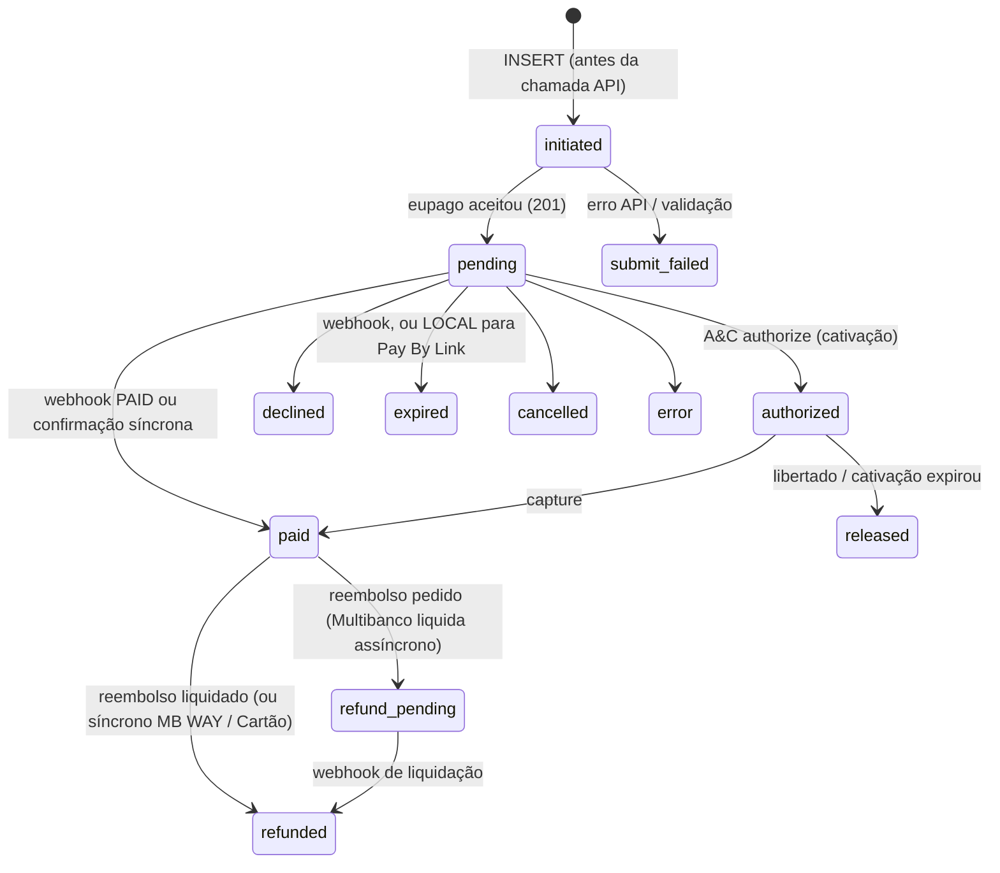
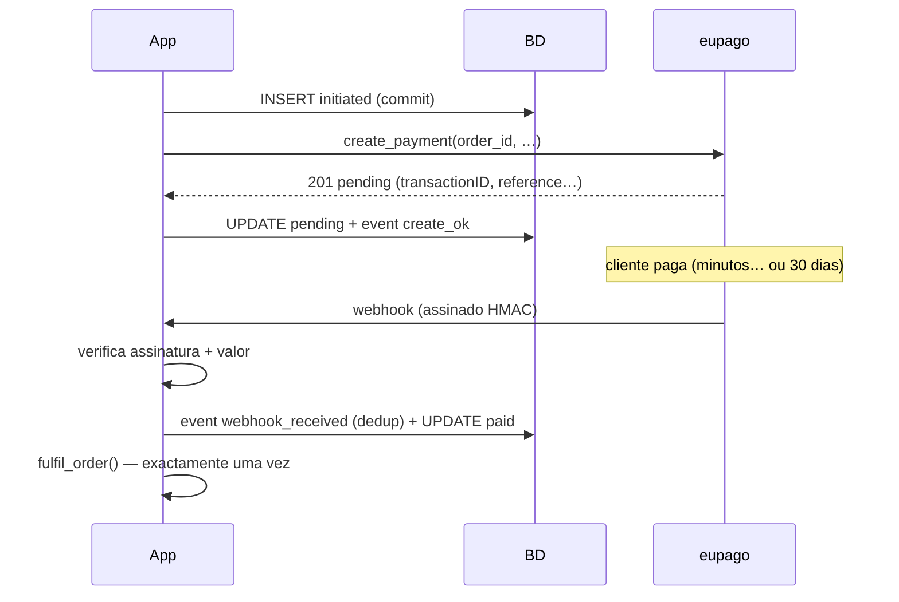
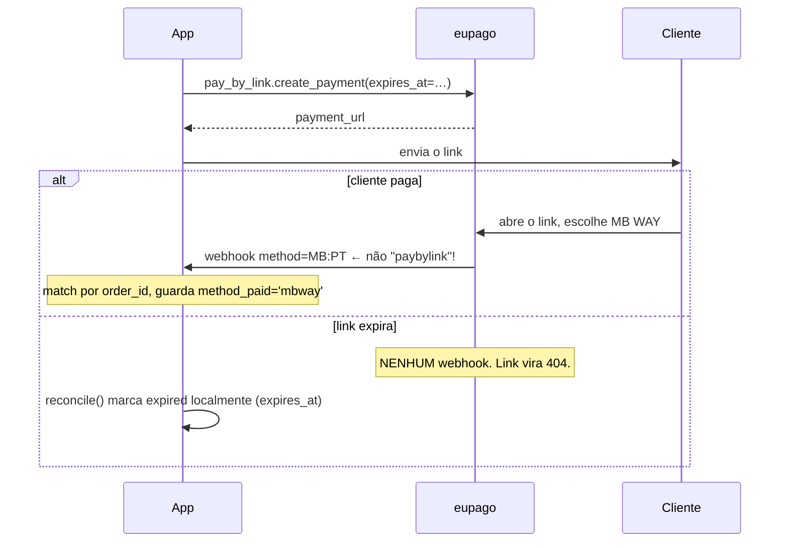
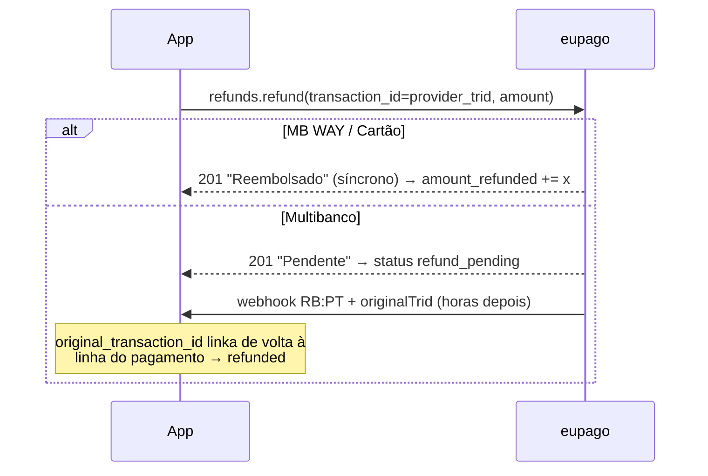

# Persistir pagamentos

Como guardar pagamentos eupago na tua base de dados de forma a não perder
nada quando um processo crasha, um webhook chega duas vezes (ou antes do
que esperavas), ou um cliente paga um Pay By Link com um método que não
previste.

Esta recipe dá-te um **esquema de referência** (PostgreSQL, com o
[mapeamento DynamoDB](#mapeamento-dynamodb) no fim), a **máquina de
estados** e as **quatro funções** que a conduzem. É agnóstica de
framework — combina com a recipe de [FastAPI](fastapi.md),
[Django](django.md) ou [Flask](flask.md) para a camada HTTP.

## A regra única: escreve antes de chamar

Insere a linha do pagamento **antes** de chamar a eupago, no mesmo
processo, com commit:

```
INSERT (status='initiated')  →  chamada API eupago  →  UPDATE (status='pending')
```

Se tudo desmoronar entre o INSERT e a resposta — processo morto, rede
caída, deploy a meio do request — fica uma linha `initiated`. Esse órfão
é *visível*: um job de reconciliação encontra-o e decide (consultar a
eupago, ou marcar como abandonado). Sem write-ahead, um crash deixa-te
com um pagamento que a eupago conhece e tu não — invisível até um
cliente zangado ligar.

O write-ahead tem um segundo benefício menos óbvio: **a linha existe
sempre antes de a eupago saber do pagamento**, logo um webhook nunca pode
chegar antes de existir algo a que se agarrar. Uma classe inteira de
race conditions desaparece por construção.

## A máquina de estados



`initiated` e `submit_failed` são estados **locais** — a eupago nunca os
vê. Tudo o resto mapeia para o enum `PaymentStatus` do SDK, que já
normaliza os códigos crus da eupago (`"Paga"`, `"Canceled"`,
`"REFUNDED"`, …) por ti.

A confirmação converge para o mesmo sítio quer seja **síncrona** (a
resposta da API já diz pago — ex.: reembolsos MB WAY / Cartão devolvem
`"Reembolsado"` imediato) quer **assíncrona** (o webhook chega minutos
ou dias depois — Multibanco pode demorar até 30 dias). O teu código não
deve querer saber qual dos caminhos trouxe a verdade.

## Esquema (PostgreSQL)

Três tabelas: estado corrente, histórico append-only e subscrições.

```sql
CREATE TABLE payments (
    id                  BIGINT GENERATED ALWAYS AS IDENTITY PRIMARY KEY,

    -- A chave de correlação. Tu gera-la, a eupago devolve-a em todas
    -- as respostas e webhooks ("identifier"). Faz match sempre por aqui.
    order_id            TEXT NOT NULL UNIQUE,

    -- O que pediste vs o que o webhook disse que foi realmente usado.
    -- Diferem no Pay By Link: pedes 'pay_by_link', o cliente escolhe
    -- MB WAY, o webhook reporta 'mbway'.
    method_requested    TEXT NOT NULL,
    method_paid         TEXT,

    -- Dinheiro é NUMERIC, nunca float. amount_refunded acumula:
    -- reembolsos parciais somam-se, não viram um boolean.
    amount              NUMERIC(12,2) NOT NULL,
    currency            CHAR(3) NOT NULL DEFAULT 'EUR',
    amount_refunded     NUMERIC(12,2) NOT NULL DEFAULT 0,

    -- Estado normalizado do ciclo de vida (CHECK, não ENUM nativo —
    -- acrescentar um estado depois é um ALTER, não uma migração de tipo).
    status              TEXT NOT NULL DEFAULT 'initiated'
        CHECK (status IN ('initiated', 'submit_failed', 'pending',
                          'authorized', 'released', 'paid', 'declined',
                          'expired', 'cancelled', 'error',
                          'refund_pending', 'refunded')),
    -- O que a eupago disse literalmente, para debug ("Paga", "REFUNDED", …)
    raw_status          TEXT,

    -- A eupago dá-te DOIS ids diferentes para a mesma transação:
    --   provider_payment_id: "transactionID" da resposta do create
    --     (string hex nos fluxos hospedados Cartão / Apple / Google Pay)
    --   provider_trid: "trid" do webhook (numérico) — é ESTE que o
    --     endpoint de reembolso quer.
    -- Guarda os dois. Provado live: um create de Google Pay devolveu
    -- 019ebcbb…  e o webhook trouxe trid 29748670.
    provider_payment_id TEXT,
    provider_trid       TEXT,

    -- Multibanco
    reference           TEXT,
    entity              TEXT,

    -- Fluxos hospedados (Pay By Link, form de cartão, wallet sheets)
    payment_url         TEXT,
    -- A expiração do Pay By Link é SILENCIOSA: nenhum webhook dispara,
    -- o link vira 404. Este prazo é teu — ver reconcile().
    expires_at          TIMESTAMPTZ,

    -- Preenchido em cobranças recorrentes de uma subscrição
    subscription_id     BIGINT REFERENCES subscriptions (id),

    initiated_at        TIMESTAMPTZ NOT NULL DEFAULT now(),
    submitted_at        TIMESTAMPTZ,
    confirmed_at        TIMESTAMPTZ,
    updated_at          TIMESTAMPTZ NOT NULL DEFAULT now()
);

CREATE INDEX payments_status_idx ON payments (status);
CREATE INDEX payments_trid_idx   ON payments (provider_trid);
```

Repara no que **não** está aqui: nenhum dado de cartão (os forms
hospedados mantêm o PAN fora do teu servidor — que continue assim), e
nenhum PII do cliente. Se precisas de ligar um pagamento a uma pessoa,
acrescenta um foreign key `customer_id` para a tua própria tabela de
utilizadores em vez de copiar telefone/email.

```sql
CREATE TABLE payment_events (
    id            BIGINT GENERATED ALWAYS AS IDENTITY PRIMARY KEY,
    payment_id    BIGINT NOT NULL REFERENCES payments (id),

    type          TEXT NOT NULL
        CHECK (type IN ('initiated', 'create_requested', 'create_ok',
                        'create_failed', 'webhook_received',
                        'webhook_rejected', 'status_changed',
                        'refund_requested', 'refund_ok', 'refund_failed',
                        'expired_locally', 'reconciled')),
    -- De onde veio a verdade
    source        TEXT NOT NULL
        CHECK (source IN ('api', 'webhook', 'reconciliation',
                          'backoffice', 'local')),

    -- O payload bruto — guardado SEMPRE já redigido (ver snippet).
    -- É a tua trilha de auditoria e a tábua de salvação no debug.
    raw           JSONB,
    -- Redelivery de webhook vira no-op em vez de duplicado.
    dedup_hash    TEXT UNIQUE,
    -- A HMAC verificou? Payloads rejeitados também se guardam (type
    -- 'webhook_rejected') mas NUNCA transitam estado.
    signature_verified BOOLEAN,

    -- Retenção RGPD: um job apaga payloads brutos depois desta data.
    -- O estado financeiro em `payments` vive para sempre; os payloads
    -- com PII não precisam.
    purge_after   TIMESTAMPTZ,

    created_at    TIMESTAMPTZ NOT NULL DEFAULT now()
);

CREATE INDEX payment_events_payment_idx ON payment_events (payment_id);
```

```sql
CREATE TABLE subscriptions (
    id                       BIGINT GENERATED ALWAYS AS IDENTITY PRIMARY KEY,

    -- A eupago dá às subscrições DOIS identificadores. Trocá-los é o
    -- bug #1 das integrações de subscrição:
    --   eupago_token: string hex devolvida pelo create_subscription —
    --     o charge_subscription() recebe ESTE.
    --   provider_subscription_id: o id inteiro (visível no URL do
    --     backoffice) — get/edit/revoke recebem ESTE.
    eupago_token             TEXT UNIQUE,
    provider_subscription_id INTEGER UNIQUE,

    status                   TEXT NOT NULL DEFAULT 'pending'
        CHECK (status IN ('pending', 'active', 'revoked', 'error')),
    created_at               TIMESTAMPTZ NOT NULL DEFAULT now(),
    updated_at               TIMESTAMPTZ NOT NULL DEFAULT now()
);
```

### Tranca o histórico

`payment_events` é append-only. Garante isso com grants, não com
disciplina — o role da aplicação simplesmente não consegue reescrever
história:

```sql
GRANT SELECT, INSERT ON payment_events TO app_role;
-- sem UPDATE, sem DELETE
GRANT SELECT, INSERT, UPDATE ON payments TO app_role;
-- sem DELETE em payments também: pagamento cancelado é um status,
-- não uma linha em falta
```

(O job de purga de retenção corre com um role de manutenção separado que
pode fazer `UPDATE payment_events SET raw = NULL` depois de `purge_after`.)

## As quatro funções

O ciclo de vida inteiro é conduzido por quatro funções pequenas.
Mostradas com SQL puro — adapta ao teu driver/ORM.

### 1. `begin_payment()` — write-ahead

```python
import uuid
from decimal import Decimal

def begin_payment(db, method: str, amount: Decimal) -> str:
    # Não-adivinhável de propósito: o order_id viaja em URLs e webhooks.
    # Ids sequenciais vazam o teu volume de vendas e convidam a enumeração.
    order_id = f"ORD-{uuid.uuid4().hex[:16]}"

    db.execute(
        """INSERT INTO payments (order_id, method_requested, amount)
           VALUES (%s, %s, %s)""",
        (order_id, method, amount),
    )
    db.execute(
        """INSERT INTO payment_events (payment_id, type, source)
           SELECT id, 'initiated', 'local' FROM payments
           WHERE order_id = %s""",
        (order_id,),
    )
    db.commit()          # ← commit ANTES de a eupago saber
    return order_id
```

### 2. `on_create_response()` — registar o que a eupago disse

```python
from eupago import EupagoClient, ValidationError, ApiError
from eupago.utils import redact_pii

def create_mbway_payment(db, client: EupagoClient, amount, phone):
    order_id = begin_payment(db, "mbway", amount)
    try:
        result = client.mbway.create_payment(
            order_id=order_id, amount=amount, phone_number=phone,
        )
    except (ValidationError, ApiError) as exc:
        db.execute(
            """UPDATE payments SET status = 'submit_failed',
                      updated_at = now() WHERE order_id = %s""",
            (order_id,),
        )
        _add_event(db, order_id, "create_failed", "api",
                   raw={"error": str(exc)})
        db.commit()
        raise

    db.execute(
        """UPDATE payments SET
               status = 'pending',
               raw_status = %s,
               provider_payment_id = %s,
               payment_url = %s,
               expires_at = %s,            -- Pay By Link: NOT NULL aqui!
               submitted_at = now(),
               updated_at = now()
           WHERE order_id = %s""",
        (str(result.status), result.transaction_id, result.payment_url,
         getattr(result, "expires_at", None), order_id),
    )
    _add_event(db, order_id, "create_ok", "api",
               raw=redact_pii(result.raw_response))
    db.commit()
    return result
```

### 3. `on_webhook()` — o único sítio onde o estado vira *paid*

```python
import hashlib
import json
from eupago.exceptions import WebhookSignatureError
from eupago.utils import redact_pii

def on_webhook(db, client, body: bytes, headers: dict) -> None:
    dedup = hashlib.sha256(body).hexdigest()

    try:
        event = client.webhooks.parse(body=body, headers=headers)
    except WebhookSignatureError:
        # Quarentena: guarda a evidência, não muda NADA. Um webhook
        # "Paid" sem assinatura é o ataque mais velho do e-commerce.
        _add_quarantine_event(db, dedup, redact_pii(body.decode()))
        db.commit()
        return  # responde 200 para um sender mal configurado parar de repetir

    row = db.fetch_one(
        "SELECT id, amount, currency, status FROM payments WHERE order_id = %s",
        (event.order_id,),
    )
    if row is None:
        # Possível para pagamentos criados fora desta app (ex.: reembolso
        # feito no backoffice). Guarda como evento sem match para o job
        # de reconciliação.
        _add_quarantine_event(db, dedup, redact_pii(body.decode()),
                              note="no matching payment")
        db.commit()
        return

    # Verifica o dinheiro antes de acreditar no estado. Um webhook que
    # diz PAID com o valor/moeda errados não fulfilla a encomenda.
    if (event.amount, event.currency) != (row.amount, row.currency):
        _add_event_by_id(db, row.id, "webhook_rejected", "webhook",
                         raw=redact_pii(json.loads(body)),
                         dedup_hash=dedup, signature_verified=True)
        db.commit()
        return

    inserted = _add_event_by_id(
        db, row.id, "webhook_received", "webhook",
        raw=redact_pii(json.loads(body)),
        dedup_hash=dedup, signature_verified=True,
    )
    if not inserted:           # UNIQUE(dedup_hash) bateu → redelivery
        db.commit()
        return                 # no-op idempotente

    db.execute(
        """UPDATE payments SET
               status = %s,
               raw_status = %s,
               method_paid = %s,        -- Pay By Link: o método REAL
               provider_trid = %s,      -- o id que o reembolso vai querer
               confirmed_at = CASE WHEN %s = 'paid'
                                   THEN now() ELSE confirmed_at END,
               updated_at = now()
           WHERE id = %s""",
        (event.status.value, event.raw_status, event.method,
         event.transaction_id, event.status.value, row.id),
    )
    db.commit()

    if event.status.value == "paid" and row.status != "paid":
        fulfil_order(event.order_id)   # exactamente uma vez, após commit
```

### 4. `reconcile()` — a rede de segurança

```python
def reconcile(db, client) -> None:
    # (a) Órfãos: initiated há > 15 min e nunca submetidos.
    #     O crash aconteceu entre o INSERT e a chamada API (ou a
    #     resposta perdeu-se).
    for row in db.fetch_all(
        """SELECT order_id FROM payments
           WHERE status = 'initiated'
             AND initiated_at < now() - interval '15 minutes'"""
    ):
        # A Management API tem GET /api/management/v1.02/transactions
        # (OAuth) para procurar por identifier — o SDK ainda não a
        # embrulha; ou chamas directamente com o teu Bearer, ou tomas o
        # caminho simples: marca 'submit_failed' e deixa o webhook
        # ressuscitar a linha se afinal a eupago conhecer a encomenda
        # (a linha do write-ahead continua lá para receber o webhook).
        ...  # update + event(type='reconciled', source='reconciliation')

    # (b) Expiração silenciosa do Pay By Link: NUNCA virá webhook.
    db.execute(
        """UPDATE payments SET status = 'expired', updated_at = now()
           WHERE method_requested = 'pay_by_link'
             AND status = 'pending'
             AND expires_at < now()"""
    )
    ...  # um event(type='expired_locally', source='local') por linha

    # (c) Purga de payloads brutos passada a retenção.
    db.execute(
        "UPDATE payment_events SET raw = NULL WHERE purge_after < now()"
    )
    db.commit()
```

Corre via cron / Celery beat de poucos em poucos minutos. É
intencionalmente aborrecido — reconciliação aborrecida é a que funciona
às 3 da manhã.

## Os fluxos

### Confirmação assíncrona (MB WAY, Multibanco, fluxos hospedados)



### Pay By Link — as duas excepções



### Reembolsos — uma transação própria



O webhook de reembolso traz `method = "RB:PT"` e um `originalTrid` a
apontar para o pagamento reembolsado — `WebhookEvent.original_transaction_id`
no SDK. Faz match por aí, não por `order_id` (um reembolso iniciado no
backoffice pode trazer um identifier que nunca emitiste).

### Authorize & capture

O `authorize` cativa o valor (`status='authorized'`, guarda o montante
autorizado), o `capture` liquida por ≤ o autorizado → `paid`. Se nunca
capturares, a cativação cai → `released`. Guarda os dois montantes: o
capturado é o que acaba em `amount`.

## Checklist de idiossincrasias

| # | Idiossincrasia | O que o esquema faz |
|---|---|---|
| 1 | O webhook do Pay By Link reporta o método que o cliente **escolheu**, nunca `paybylink` | `method_requested` vs `method_paid`; match só por `order_id` |
| 2 | A expiração do Pay By Link é **silenciosa** — sem webhook, o link dá 404 | `expires_at` + `reconcile()` marca `expired` localmente |
| 3 | `transactionID` do create ≠ `trid` do webhook (fluxos hospedados; provado live: `019ebcbb…` vs `29748670`) | Duas colunas; reembolsos usam `provider_trid` |
| 4 | Reembolsos são transações separadas (`RB:PT` + `originalTrid`); parciais acumulam | `amount_refunded` acumulador numérico, nunca boolean |
| 5 | Webhooks podem ser **re-entregues** e correr contra as tuas escritas | `dedup_hash UNIQUE` no-op + write-ahead garante que a linha existe primeiro |
| 6 | Multibanco confirma em 1–30 dias; reembolso Multibanco liquida assíncrono (`Pendente` → webhook) | `pending` é um estado longo perfeitamente saudável; `refund_pending` |
| 7 | Subscrições têm dois ids (`eupagoToken` hex vs `subscriptionId` inteiro) | Ambas as colunas em `subscriptions`, cobranças linkam via FK |
| 8 | Os estados crus da eupago são inconsistentes (`"Paga"`, `"Canceled"`, `"REFUNDED"`) | O SDK normaliza em `status`; o literal fica em `raw_status` |

## Notas de segurança

O esquema já codifica a maior parte da postura de segurança — esta é a
versão curta; o [guia de Segurança](../security.md) tem o raciocínio:

- **Dados de cartão: nunca.** Os forms hospedados mantêm o PAN fora do
  teu servidor (território SAQ A). Não faças proxy do form para
  "melhorar" o UX.
- **Só webhooks com assinatura verificada mudam estado.** HMAC falhada →
  linha `webhook_rejected` em quarentena, sem transição.
- **O redirect do browser não é confirmação.** Qualquer um navega para o
  teu `success_url`. Só o webhook assinado (ou poll autenticado) vira
  `status` para `paid`.
- **Verifica valor + moeda** contra a linha guardada antes de fulfillar.
- **Payloads brutos guardam-se redigidos** (`eupago.utils.redact_pii`) e
  expiram via `purge_after`. O estado vive para sempre; o PII não.
- **O histórico é append-only por grant**, não por convenção.
- **O `order_id` é não-enumerável** (UUID) — viaja em URLs.

## Mapeamento DynamoDB

O mesmo desenho cabe numa single-table:

| Item | PK | SK | Notas |
|---|---|---|---|
| Pagamento (estado corrente) | `ORDER#{order_id}` | `META` | Todas as colunas de `payments` como atributos |
| Evento | `ORDER#{order_id}` | `EVENT#{iso_ts}#{seq}` | Payload redigido; atributo `ttl` = `purge_after` (TTL nativo apaga) |
| Subscrição | `SUB#{eupago_token}` | `META` | Guarda os dois identificadores |

Global secondary indexes:

- **GSI1** `provider_trid` → encontrar o pagamento quando um
  webhook/reembolso só te dá um trid (reembolsos iniciados no backoffice).
- **GSI2** `status` (+ range key `initiated_at`) → os scans do
  `reconcile()`: órfãos `initiated` e Pay By Links `pending` expirados.

Diferenças que importam vs PostgreSQL:

- **Idempotência** usa conditional put no item do evento
  (`attribute_not_exists(PK)` com o dedup hash na chave) em vez de
  UNIQUE constraint.
- **Append-only** é uma policy IAM que permite `PutItem`/`UpdateItem`
  nos items `META` mas só `PutItem` nos `EVENT#`.
- **Retenção** é o atributo TTL nativo — define-o nos items de evento
  na escrita e o DynamoDB apaga-os de graça.
- **Dinheiro**: guarda montantes como strings (`"49.90"`) ou cêntimos
  inteiros — nunca o tipo float. `Decimal` faz round-trip limpo com
  boto3.

## Checklist antes de ir para produção

- [ ] `begin_payment` faz commit **antes** da chamada à eupago
- [ ] Handler de webhook: verificar → dedup → check de valor → transição → fulfil
- [ ] `reconcile()` agendado (órfãos, expiry PBL, purga)
- [ ] Grants: o role da app não pode UPDATE/DELETE `payment_events`
- [ ] Payloads brutos passam por `redact_pii()` à entrada
- [ ] O caminho de reembolso usa `provider_trid` (do webhook), não o id
      da resposta do create
- [ ] `fulfil_order()` dispara exactamente uma vez (guarda na *mudança*
      de status)
